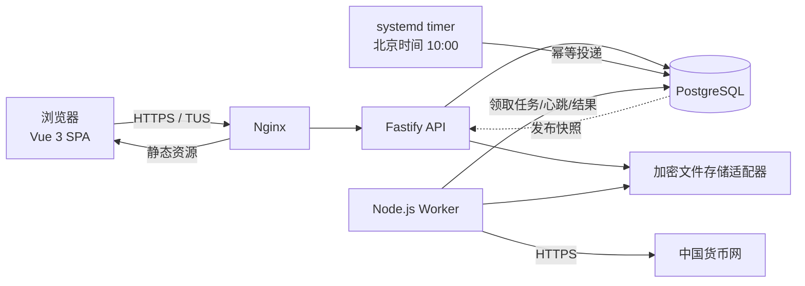
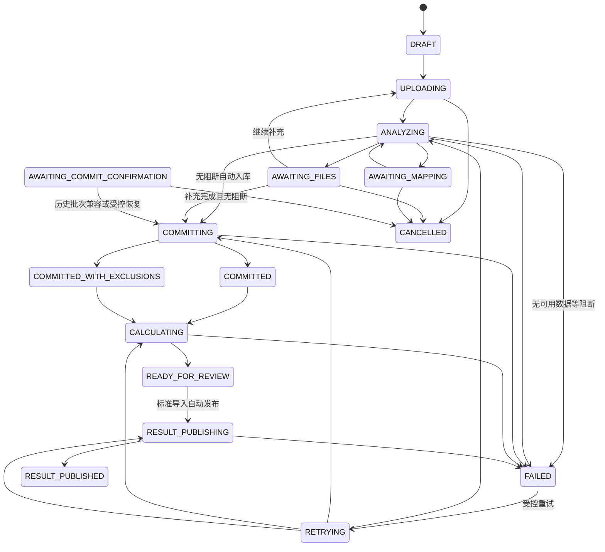

# 跨境电商平台收入与平台成本测算小工具——软件设计说明书

| 项目 | 内容 |
|---|---|
| 文档状态 | 已确认的首版设计基线，待实施 |
| 版本 | 1.0 |
| 日期 | 2026-07-27 |
| 工作区 | `D:\wwwroot\revenue-and-costs` |
| 数据库 | 独立 PostgreSQL |
| 目标部署 | 单台 Linux 服务器，可演进到共享对象存储/多机 Worker |

> 本文描述目标系统，不代表功能已经实现。实现完成必须以本文的验收标准、自动化测试和可观察运行证据为准。

## 1. 目标、范围与设计原则

### 1.1 产品目标

构建一个面向跨境电商经营者的独立 Web 应用，完成：

1. 手机号登录、用户/客户协作、管理员治理；
2. 余额充值、应用消费、店铺期限管理；
3. 中国外汇交易中心人民币汇率全量同步、每日增量同步及批量换算；
4. 大体积 Amazon 交易报告与配送货件的上传、清洗、配对、版本化和追溯；
5. 收入、退款、平台代扣税、平台费用及平台结余的统一人民币测算；
6. 按日期与站点查询、完整性检查、费用追溯和 Excel/CSV 导出；
7. 为每个做账员保存可选的利润率与最低销售成本率，并在导出前预览采购成本与利润测算。

系统优先级为：**财务正确性与可追溯性 > 数据安全与恢复能力 > 稳定性 > 响应速度 > 代码量与视觉效果**。代码保持精简，但不得以静默错算、丢失版本或降低权限边界为代价。

### 1.2 首版非目标

- 不采集采购成本事实，不计算人工成本、企业所得税或真正净利润；结果页差额仍统一称为“平台结余”。导出页可以按做账员明确填写的利润率和最低销售成本率推算采购成本，但该测算不得写回发布快照或冒充采购事实。
- 不解析或上传 PDF 内容；浏览器只登记 PDF 相对路径，服务端以“未解析”列入预检，不能提供并不存在的原件下载。
- 不建设微服务、Kubernetes、Kafka、Redis 集群或实时数仓。
- 不把原始文件写入 PostgreSQL `bytea`，也不把每行全部原始字段复制为 JSONB。
- 不提供余额提现、用户自助退款或生产商户自动开户。
- 不复刻图 2 的资金流/Sankey 图。
- 不承诺单机部署具备高可用；通过异机备份和可恢复设计控制风险。

### 1.3 设计输入

- 视觉参考：`D:\wwwroot\googcci\src\googcci\portal\v0.2`
- 业务样例：`D:\wwwroot\revenue-and-costs\nas\data\KU-2025年第四季度税务汇总`
- 结果表参考：`C:\Users\Damian\Downloads\销售成本表-1785152662.xlsx`
- 汇率来源：[中国货币网人民币汇率中间价历史数据](https://www.chinamoney.com.cn/chinese/bkccpr/)

以上本地业务文件均按敏感数据处理，不进入源码、测试夹具或日志。测试使用字段结构一致的脱敏/合成数据。

## 2. 已冻结的关键决策

| 主题 | 首版决策 |
|---|---|
| 系统形态 | TypeScript 模块化单体；API 与 Worker 分进程 |
| 前端 | Vue 3 + Vite，沿用四主题视觉契约 |
| 后端 | Fastify；API 不执行大文件解析 |
| 后台任务 | 独立 Node.js Worker；PostgreSQL 持久队列，优先采用 `pg-boss` |
| 数据访问 | `pg` + 显式 SQL/迁移；首版不使用 ORM |
| 财务计算 | `decimal.js` + PostgreSQL `numeric`；API 中金额与汇率均传字符串 |
| 文件处理 | 可恢复分片上传、流式 ZIP/CSV/TXT、结构有效且映射已确认的配送 XLSX、PostgreSQL `COPY`、流式 XLSX 导出 |
| 原件 | 加密、不可变文件对象；数据库只存标准化字段和行级来源引用 |
| 数据发布 | 不可变数据版本、计算运行和发布快照；事务切换当前指针 |
| 租户与计费 | 企业是公司和钱包的归属主体；做账员通过企业成员关系协同处理公司 |
| 汇率 | 原始快照 + 规范化报价双层保存；北京时间 10:00 每日同步并回补最近 7 天 |
| 部署 | 单台 Linux：Nginx、SPA、Fastify API、Node Worker、PostgreSQL、加密数据卷 |
| 演进边界 | 只有基准证据证明 Node 窄模块不足时，才替换为 Python/Rust 子进程 |

## 3. 术语与核心实体

| 术语 | 定义 |
|---|---|
| 账户 | 由稳定 UUID 标识的登录主体；手机号只是唯一登录标识，可经双重验证换绑 |
| 做账员 | 使用手机号登录的平台角色，可创建或加入多个企业 |
| 管理员 | 具备平台治理能力的平台角色；使用应用免费但仍产生减免审计 |
| 企业 | 公司、企业钱包和做账员协作关系的业务归属主体 |
| 企业成员 | 做账员对企业资源的平权访问关系；状态为待加入、有效或已撤销 |
| 客户 | 某个公司范围内的只读成员关系，不是平台角色 |
| 应用 | 可配置名称、上下架、排序、角色权限和年度价格的收费能力；首版为“亚马逊销售成本” |
| 公司 | 企业对某应用的付费业务空间，拥有名称、期限、数据版本和客户成员；内部历史表名仍使用 `shop` |
| 来源文件 | 用户上传的 CSV/TXT、结构有效且映射已确认的配送 XLSX、ZIP 内条目及其加密原件引用 |
| 数据切片 | `店铺 + 规范化站点 + 报表字面月份` 的最小完整性与版本切换单位 |
| 数据版本 | 某个数据切片的完整不可变来源快照，可复用上一版本未修改的报告 |
| 计算运行 | 固定数据、映射、公式、汇率和策略版本的一次可重现计算 |
| 发布快照 | 面向正式页面、导出和客户读取的不可变计算结果 |
| 正式汇总 | 只包含满足硬完整性条件且未被排除的数据切片的发布快照汇总 |

## 4. 身份、角色与权限

### 4.1 身份模型

每个已注册账户必须且只能拥有一个互斥平台角色：`ACCOUNTANT` 或 `ADMIN`。企业和客户都不是登录角色。

- 普通手机号自助注册后获得 `ACCOUNTANT`；账号名称选填，可在账号设置中随时修改或清空，服务端统一执行去除首尾空白、NFC 规范化和最长 80 字符校验；头像由服务端随机分配 `1-59`；
- `ADMIN` 只能由现有管理员设置，并保护最后一个有效管理员；升级或降级都吊销旧会话，企业成员关系不变；
- 做账员可创建或加入多个企业。企业名称和统一社会信用代码在新建时必填，信用代码规范化后唯一；
- `enterprise_member` 同时承载 `PENDING`、`ACTIVE`、`REVOKED`。手机号必填、姓名选填，待加入关系永不过期但可人工撤销；
- 企业新增已注册手机号时立即激活；未注册手机号可直接使用登录模式验证 OTP，成功后自动创建 `ACCOUNTANT` 并激活该手机号的全部企业待加入关系；无邀请的新手机号登录仍提示先注册；
- 企业成员平权，均可查看和处理企业全部公司、管理成员和使用企业钱包；最后一名有效成员不能删除；
- 第一位管理员通过一次性初始化命令创建，初始化完成后入口永久关闭。

客户邀请不要求复制令牌或手工确认。已注册的 `ACCOUNTANT` 或 `ADMIN` 可同时成为其他公司的客户；客户关系不改变平台角色和企业能力。撤销客户关系时，该客户与公司相关的 `QUEUED`、`RUNNING`、`SUCCEEDED` 导出授权和全部下载令牌立即失效；下载请求始终重新校验当前 membership，不能只验证旧令牌。

### 4.2 权限矩阵

平台角色决定治理能力，企业成员和公司客户分别决定业务对象权限。

| 平台能力 | `ACCOUNTANT` | `ADMIN` |
|---|---:|---:|
| 外汇查询与批量换算、账号设置 | 是 | 是 |
| 创建企业、加入多个企业 | 是 | 查看全部企业 |
| 使用企业钱包、创建和管理公司 | 有效企业成员，企业钱包扣费 | 全局覆盖；免费并审计 |
| 查看获授权公司的正式结果 | 作为公司客户时 | 治理覆盖 |
| 做账员、应用、映射、站点策略管理 | 否 | 是 |
| 下载其他主体原件 | 否 | 默认只看元数据；填写原因后授权下载 |

| 公司内能力 | `ENTERPRISE`（有效企业成员） | `CUSTOMER`（客户成员） | `ADMIN` 平台覆盖 |
|---|---:|---:|---:|
| 创建/改名/续期/删除 | 是 | 否 | 是，审计 |
| 上传、确认入库、发布正式结果、回滚版本 | 是 | 否 | 是，审计 |
| 排除硬不完整/确认软警告 | 是 | 否 | 是，审计 |
| 查看结果 | 自己店铺全部状态 | 仅已发布快照 | 全部，审计 |
| 导出结果 | 是 | 默认否；membership 可单独开启 | 是，审计 |
| 下载原件 | 是 | 否 | 填写原因后授权下载 |

公司必须归属一个企业并记录创建做账员、最近操作做账员和做账状态。最近操作人在上传、确认、异常确认、发布、续费、改名、删除和恢复时更新。做账状态只投影为 `未做账` 或 `已提交`：只有当前正式快照与最新数据版本一致时为已提交，其余情况均为未做账。管理员免费创建公司仍必须选择企业，并记录当前原价、实付 0、`ADMIN_FREE`、操作者和价格版本，但新建原因允许为空；管理员续期仍必须填写原因。历史带原因记录及其幂等重放保持不变。

企业创建者永久视为企业资料负责人，不新增平台角色，也不支持转交。创建者保持有效企业成员资格时只能修改企业名称；普通企业成员对名称和统一社会信用代码均只读；管理员可以修改任意企业的名称和统一社会信用代码。历史信用代码为空时也只能由管理员补录。企业查询必须返回创建者 ID 和逐字段能力，PATCH 按字段授权并记录前后值审计；创建者失去成员资格后仅管理员可修改。

所有 API、文件和导出访问都按 `actor + resource_id + capability` 在服务端校验。未授权资源统一返回不泄露存在性的 404，或在明确登录态场景返回 403；不得依赖前端菜单隐藏。

### 4.3 登录与账号安全

- 登录方式：手机号 + 短信验证码；开发环境使用显式标记的合成验证码适配器，正式生产环境更换真实供应商。2026-08-10 批准的固定码受控试运行允许预置管理员及已注册账号暂用运维侧固定码，且不得向 API 响应或日志披露固定码；用户随后明确要求取消额外边缘 Basic Auth，公网访问控制由 OTP 限流、Origin/CSRF 和会话校验承担。
- 首次使用可切换到“做账员注册”，验证手机号，姓名选填；头像由服务端随机分配 `1-59`。注册成功后使用同一次已消费的注册验证结果原子签发服务端会话并直接进入工作台，不再要求返回登录或重复获取验证码；该会话同时按首次成功登录规则更新账号登录事实。只有存在企业待加入关系的未知手机号可在登录验证后自动创建账号，其他未知手机号不得静默注册。
- 开发环境沙箱验证码可通过配置固定，首版本地验证默认 `246810`。正式生产仍禁止沙箱验证码和注册即授予管理员；受控试运行只能通过独立的 `TEMPORARY_ADMIN_OTP_CODE` 显式配置固定码，且不返回验证码。默认仍仅接受预置管理员登录；用户明确启用 `TEMPORARY_PUBLIC_REGISTRATION` 后，任意符合格式的手机号可请求 `REGISTER` 固定码、注册为 `ACCOUNTANT` 并直接建立会话；`PHONE_CHANGE_OLD/NEW` 继续拒绝。首位管理员由初始化命令创建；其他管理员授权与最后管理员保护保持既有逻辑。
- OTP 按手机号、IP、设备和用途限流；使用独立服务端密钥对 `challenge_id + phone + purpose + code` 做 HMAC，只保存 HMAC、有效期和失败次数，常量时间比较并在事务中一次性消费，避免数据库泄露后离线穷举短验证码。
- 使用服务端会话和 `Secure`、`HttpOnly`、`SameSite` Cookie，不把长期访问令牌放入浏览器存储。
- “首次登录”是账号级、并发安全的成功登录事实，不以注册时间、是否已有企业、前端本地存储或某个页面是否访问过推断。`account` 持久化可空的 `first_login_at`、可空的 `last_login_at` 和单调递增的 `successful_login_count`；签发会话时在同一事务内锁定账号、首次写入/更新这三个字段，并把本次序号固化到 `auth_session.login_sequence`。只有序号为 1 的会话属于首次登录；注册但从未成功登录的账号保持计数 0，两个并发登录只有一个会话可获得序号 1。
- 客户邀请的内部标识、密码式恢复占位和下载令牌使用密码学安全随机高熵值，数据库只保存摘要；前端不展示或要求客户输入邀请令牌。账户禁用、手机号换绑和平台权限变化立即吊销相关会话。企业撤员和客户撤权无需注销整个账户，但所有企业与公司请求实时检查成员关系。
- 手机号唯一；换绑必须同时验证旧手机号和新手机号。企业钱包、公司和历史记录属于企业 UUID，不随做账员手机号或成员变化。
- 管理员查看用户财务结果自动记录访问审计，原因可以为空；调整余额、改变角色和下载原件必须填写原因，并记录操作者、对象、前后值和请求上下文。

## 5. 总体架构

### 5.1 进程职责

**Nginx**

- TLS 终止、静态 SPA、API 反向代理；
- 对分片 PATCH 关闭请求缓冲，限制单分片而不是把 2GB 作为单请求；
- 设置安全响应头、请求速率和超时边界。

**Fastify API**

- 鉴权、权限、轻量命令和查询；
- 创建上传会话、校验 offset、接收单个分片；
- 支付下单与回调验签；
- 创建任务、读取进度、签发短期一次性下载；
- 不解析完整 ZIP/CSV，不执行大范围汇总，不生成完整工作簿。

**Node.js Worker**

- 文件校验、加密归档、ZIP 条目流式读取；
- CSV/TXT 编码与表头识别，以及配送 XLSX 的受限流式读取、映射、站点拆分和 `COPY` 入库；
- 完整性检查、汇率同步、计算、重算、发布快照和导出；
- 对 CPU 密集步骤使用受控 Worker Thread/子进程，避免阻塞租约心跳，但仍保持单语言。

**PostgreSQL**

- 账户、权限、钱包、订单、店铺、数据版本、事实、汇率、汇总、任务和审计；
- 使用事务、唯一约束、条件更新和行锁维护不变量；
- 不保存大文件二进制。

**文件存储适配器**

- 首版实现本地加密卷；接口预留 S3/MinIO；
- 业务层只能通过对象 ID 访问，不拼接真实磁盘路径；
- 对象先完整写入并校验哈希，再建立业务引用；孤儿对象延迟回收。

### 5.2 模块边界

| 模块 | 职责 |
|---|---|
| `identity` | 手机号、OTP、会话、状态、平台角色、换绑 |
| `memberships` | 客户邀请、店铺成员、查看/导出权限 |
| `billing` | 支付订单、回调 inbox、钱包账本、调账、管理员减免 |
| `catalog` | 应用、角色策略、排序、价格版本、上下架 |
| `shops` | 店铺、一次改名、期限、续费、回收站、名称占用 |
| `uploads` | 上传会话、offset、分片、哈希、对象归档、配额 |
| `imports` | 分类、解包、编码、映射、预检、版本发布和回滚 |
| `fx` | 原始汇率快照、规范化报价、同步、覆盖率、批量换算 |
| `costing` | 标准事实、费用单元格分类、计算运行、月度汇总 |
| `publishing` | 完整性门禁、排除/忽略、发布快照和过期标记 |
| `exports` | v9 五 Sheet XLSX、超限 CSV ZIP、短期下载；汇率追溯保留在数据库审计链路 |
| `admin` | 用户、应用、映射、站点策略和审计查询 |
| `jobs` | PostgreSQL 队列、重试、租约、心跳和失败终态 |

模块通过显式服务接口和数据库事务协作。金额公式、权限判定、状态转换和字段映射各自只有一个生产实现。

## 6. 数据模型

### 6.1 建议表组

以下是逻辑表名，实施时可按统一命名规范微调，但不能丢失约束：

| 表组 | 关键表 | 关键约束 |
|---|---|---|
| 身份 | `account`、`account_role`、`otp_challenge`、`auth_session` | 手机号唯一；平台角色仅 `ACCOUNTANT/ADMIN`；账号保存首次/最近成功登录时间和成功登录次数，会话固化账号内登录序号；账号保存可空的利润率和最低销售成本率偏好；最后管理员保护 |
| 企业协作 | `enterprise`、`enterprise_member` | 信用代码唯一；有效成员和待加入手机号唯一；最后有效成员保护 |
| 客户协作 | `shop_invitation`、`shop_membership` | 同一账户/店铺最多一个有效成员；默认不可导出 |
| 钱包支付 | `wallet_account`、`wallet_ledger`、`payment_order`、`payment_event_inbox`、`payment_reversal` | 新钱包归属企业；账本追加；订单记录入账钱包和发起做账员 |
| 应用计价 | `application`、`application_price_version`、`application_role_policy` | 价格不可覆盖历史；新价格只影响新建和续费 |
| 公司 | `shop`、`shop_name_history`、`shop_term`、`shop_charge` | 必属企业；活跃+回收站期间企业内名称唯一；改名最多一次 |
| 对象上传 | `stored_object`、`upload_batch`、`upload_file` | offset 单调；完成哈希固定；同店铺范围 SHA-256 去重 |
| 导入映射 | `import_batch`、`import_file`、`import_issue`、`field_mapping`、`field_mapping_version` | 未知映射不能发布；问题定位到文件/行/字段 |
| 数据版本 | `dataset_slice`、`dataset_version`、`dataset_source_binding` | 当前版本指针原子切换；旧版本不可变 |
| 标准事实 | `shipment_fact`、`transaction_fact`、`transaction_fee_component` | 每行保存来源文件、行号、行哈希；费用单元格唯一分类 |
| 汇率 | `fx_raw_snapshot`、`fx_quote`、`fx_override` | 来源快照不可变；日期/币对/版本唯一；人工值独立 |
| 计算发布 | `calculation_run`、`monthly_cost_summary`、`published_snapshot`、`published_snapshot_slice` | 固定所有输入版本；旧快照不被重算覆盖 |
| 质量治理 | `marketplace_policy_version`、`reconciliation_result`、`quality_acknowledgement` | 未知站点默认大站点；确认绑定具体数据版本 |
| 导出 | `export_request`、`export_file_manifest`、`stored_object`；队列执行事实使用 `pgboss.job` | 下载令牌短期一次性；客户只从发布快照导出；不另建第二套队列租约表 |
| 任务审计 | `pg-boss` 内部队列表、`job_outbox`、`job_operation`、`audit_event` | 队列租约只有一个事实来源；outbox 只保证事务投递 |

### 6.2 数值、日期与接口类型

- 钱包、充值和店铺收费：整数分，使用 `bigint`；前端/API 使用十进制字符串，禁止浮点换算。
- 汇率、原币业务金额和人民币折算金额：`numeric(30,8)`；中间计算使用 `decimal.js`，按 `ROUND_HALF_UP` 保留 8 位。
- 新充值到账金额等于实付金额，折扣基点固定为 `10000`；历史 `9000/8000` 订单的退款反算继续按其原订单参数执行。
- 展示和普通报表金额为 2 位小数，但底层金额和数据库汇率追溯记录保留 8 位。
- 业务日期使用 `date`；带时间字段保存 `timestamptz`、原始文本、来源解析时区和报表字面日期，避免丢失绝对时间审计证据。现有数据库列 `marketplace_local_date`、`local_month` 及接口字段 `localDate` 仅保留兼容命名；报表字面日期策略生效后的新数据版本中，其语义分别为报表日期和报表字面月份，历史不可变事实不回写。
- API 中 `numeric`、`bigint`、日期和时间均序列化为字符串。

### 6.3 发布快照可重现性

每个 `calculation_run` 必须固定：

- 店铺和应用价格/公式版本；
- 每个站点月份的数据版本；
- 字段映射版本；
- Marketplace 规范化、日期归属模式和来源 IANA 时区版本；
- 大/小站点策略版本；
- 每条事实实际使用的官方汇率或人工汇率 ID；
- 纳入、排除、警告和确认记录；
- 代码/计算规则版本及创建时间。

发布后生成不可变 `published_snapshot`。客户只读取该快照；用户可在预览区查看未发布计算。新数据、映射或汇率生效后，旧快照只标记“有更新可重新计算”，不得静默改变。

### 6.4 核心状态转换

| 对象 | 正常状态 | 约束 |
|---|---|---|
| 支付订单 | `CREATED → PENDING → PAID / FAILED / CLOSED`；付款后的撤销另记 `PARTIALLY_REVERSED / REVERSED / CHARGEBACK` | 原 `PAID` 事实不改；重复渠道事件只返回既有结果 |
| 店铺 | `ACTIVE → EXPIRED_READONLY → ACTIVE`，删除为 `TRASHED → PURGED` | `PURGED` 是业务墓碑，不删除账本、审计和长期保留原件 |
| 企业成员 | `PENDING → ACTIVE → REVOKED` | 待加入不自动过期；最后一名有效成员不可撤销 |
| 客户邀请/成员 | `PENDING → ACTIVE → REVOKED / EXPIRED` | 撤权同步失效下载令牌和所有状态的相关导出授权 |
| 数据版本 | `DRAFT → INCOMPLETE / READY → ACTIVE → SUPERSEDED` | 回滚只切换 current 指针，不改旧版本 |
| 计算运行 | `QUEUED → RUNNING → READY / BLOCKED / FAILED` | 固定全部输入版本；重算生成新运行 |
| 发布快照 | `CURRENT → STALE → SUPERSEDED` | `STALE` 仍可追溯，不自动更新内容 |
| 异步任务 | `QUEUED → RUNNING → SUCCEEDED`，失败为 `RETRY_SCHEDULED → DEAD` | 有租约、心跳、有限重试和幂等业务键 |

状态变更使用条件更新或行锁，并把关联账本、审计和指针切换放在同一事务中。

## 7. 店铺、计费与生命周期

### 7.1 充值

做账员为当前企业钱包充值，最低 100.00 元。充值入口只显示一个“充值”主操作，不再要求用户先执行“获取报价”或二次确认；该操作仍在服务端经过现有精确报价、幂等订单、支付适配器和追加式账本链。金额输入框以 `10000.00` 作为纯占位示例；占位值不写入表单状态、不创建订单，也不改变最低充值额。所有新订单到账金额等于实付金额，不再提供累计金额或分档折扣；报价和订单折扣基点固定为 `10000`。支付渠道首版提供微信、支付宝统一适配器和沙箱实现；生产商户号、证书、回调域名配置到位后才允许开启真实支付。2026-08-10 经用户明确批准的受控试运行可启用 `temporary-manual` 适配器，由系统即时确认到账；它不代表外部支付成功，仍必须经过幂等订单、签名事件、追加式钱包账本和审计链，readiness 保持 `degraded`。企业钱包流水中的公司创建或续期扣款必须显示对应公司名称；账本仍保存稳定公司 ID，即使公司随后改名或回收也不得失去扣款归属。

支付回调必须依次校验原始报文签名、商户号、内部订单号、渠道交易号、币种和金额。更新订单和追加钱包账本在同一事务内完成；重复或乱序回调只能返回已处理结果，不能重复入账。

不提供用户自助退款，但必须处理渠道退款、撤销、拒付和日终差错：

- 原 `PAID` 和原充值账本不修改，所有变化追加 `payment_reversal` 与反向钱包账本；
- 反向余额按累计值计算，避免多次部分退款的逐笔舍入残差：`累计应扣余额 = ROUND_HALF_UP(原到账分 × 累计退回应付分 / 原应付分)`，本次账本只追加“新累计应扣余额 - 上次累计应扣余额”；渠道应付金额全部撤销时，强制累计扣回精确等于原到账余额；
- 历史 `9000/8000` 折扣订单仍按原到账与应付比例反算退款，不修改历史财务事实；
- 若扣回后余额为负，企业钱包进入 `RESTRICTED_DEBT`，允许成员登录、查看和充值补足，但禁止新消费、建公司和续期；既有公司和历史账本不回滚；
- 无法自动匹配、超过原交易或状态冲突的渠道事件进入人工对账，账户先限制消费，管理员处理必须填写原因；
- 每日按渠道账单对账支付、退款和拒付，恢复数据库后也执行同一对账流程。

### 7.2 店铺收费

- 首版应用名：“亚马逊销售成本”；当前年度价格 188.00 元，通过应用价格版本管理。
- 创建输入：企业、公司名称、开始日期、关闭日期；关闭日期默认是开始日期的首个日历周年。
- 计费年数为满足 `requested_close_date <= anniversary(start_date, n)` 的最小正整数 `n`，费用为 `n × 创建时价格版本`。
- 例如开始到关闭为一个半日历年时，`n = 2`，当前价格下收费 `2 × 188 = 376` 元。
- 有效期采用半开区间 `[start_date 00:00, close_date 00:00)`（北京时间）：开始日有效，关闭日 00:00 起进入只读过期状态。界面同时显示最后可用日期，避免误解。
- 2 月 29 日的非闰年周年取 2 月最后一天。示例：2024-02-29 至 2025-02-28 为一个计费年。
- 关闭日期只能延长，不能缩短或退款；续期固定当次价格版本并只收新增周年数。
- 关闭日期必须晚于开始日期；延长后的日期必须晚于当前关闭日期。
- 扣款、公司创建/续期、价格版本引用和企业钱包账本写入同一事务并锁定钱包，防止不同做账员并发透支。
- 管理员实扣为 0，但必须选择企业并写入原价、减免类型、价格版本和实际扣款 0；新建公司的减免原因允许为空，续期等其他特权操作仍要求原因。

### 7.3 名称、改名、过期与删除

- 公司名称在同一企业的活跃区和 30 天回收站中唯一；其他企业可使用同名。
- 创建公司命中同企业名称唯一约束时返回 `409 SHOP_NAME_CONFLICT` 并关联 `name` 字段，提示做账员检查使用中及回收站公司或更换名称，不得作为服务器内部错误返回。
- 每个新店铺最多成功改名一次；恢复店铺不重置次数。
- 过期后允许查看和导出已发布结果，不允许上传、重算或发布；续期后恢复。
- 删除后进入 30 天回收站，不退款；恢复保持期限、版本和改名状态。
- “永久删除”在本产品中是业务墓碑：从用户操作界面移除并释放名称，但钱包、审计、发布快照和按既定长期保留要求保存的加密原件不物理删除。首版不宣称支持法律意义上的彻底擦除；若未来法规要求销毁，必须另行设计覆盖在线对象、wrapped DEK、异机副本、数据库/WAL/PITR 和过期备份的保留及密钥方案，不能把普通删除描述成密钥销毁。

### 7.4 历史迁移

- 使用前向迁移；已有 `USER/CUSTOMER` 平台角色转为 `ACCOUNTANT`，原公司客户关系保留，管理员保持 `ADMIN`；
- 每个已有公司或钱包主体创建一个“历史数据待补录”企业；同一历史主体的公司、钱包余额和账本迁入同一企业；
- 历史企业是信用代码可为空的唯一例外。补齐企业名称和信用代码前，可以查看和处理已有公司及历史账本，但禁止充值、新建公司和新增成员；
- 已有价格版本、20 元历史收费、期限、数据版本、正式快照、导出和客户授权全部保留；188 元价格版本只影响迁移后的新建和续费；
- 迁移验收逐项核对公司、钱包、账本、收费、快照和客户授权数量，并校验迁移前后余额与追加式账本摘要一致。

## 8. 上传、解析与数据版本

### 8.1 上传协议

- 浏览器支持选择文件夹和 ZIP；文件夹上传保存 `relativePath`。直接选择的 PDF 仅登记相对路径和元数据，不发送正文；普通 ZIP 在创建批次前以有界尾部和中央目录预检，发现 PDF 条目、ZIP64、多卷或无法安全判定时整包拒绝并提示改用文件夹，服务端在内容识别与展开阶段再次失败闭合，不能持久化 PDF 正文。
- 使用 TUS 或等价的可恢复分片协议；默认分片 16MiB，可配置在 8–32MiB；批次默认上限 2GB。
- 浏览器 API 客户端不得对所有请求施加统一的总时长中止；上传由用户显式取消、调用方信号或服务端边界终止，不能因固定 60 秒客户端计时器丢弃仍在持续传输的分片。
- CSV/TXT 等可压缩分片允许在浏览器确认压缩后确实更小时使用逐分片 gzip 传输；offset、声明长度和 SHA-256 始终以解压后的原始字节为准。服务端必须流式解压并继续执行 16MiB 解压后上限、哈希和长度校验，归档结果与用户选择的原文件逐字节一致；不支持压缩或压缩无收益时直接发送原始分片。
- 默认单批物理上传文件数与 ZIP 条目数分别及合计都不得超过 20,000；文件夹上传也适用，不能用大量微小文件绕过。单个相对路径 UTF-8 最多 1,024 字节、单段最多 255 字节。限额在创建清单和读取 ZIP 中央目录时分别校验。
- 创建上传批次时以一次有界请求原子写入批次、导入批次和整份文件清单；同一幂等键重放返回原文件 ID、顺序和当前 offset，任一清单写入失败必须整体回滚并清理新建暂存文件，不能留下孤儿批次。上传会话、文件清单、当前 offset、分片校验和和完成状态保存在 PostgreSQL；新注册文件直接使用响应中的 offset，只有失败重试或恢复既有批次时才额外查询服务端 offset。
- 浏览器原生目录选择器每次只授权一个目录；页面必须允许连续追加目录、一次拖入多个目录，或选择这些目录的共同父目录，并合并成同一份待上传清单。创建服务端批次前，用户可以通过逐项复选或全选从待上传清单移除文件；移除只改变尚未上传的浏览器清单，不删除已归档原件或历史数据版本。批次一经创建即冻结文件清单与本次核算范围，刷新或重试继续使用同一批次，不能把新的本地选择静默混入。
- 创建批次时可以同时冻结可选的本次核算起止月份，格式为 `YYYY-MM`。两端必须同时提供、起月不得晚于止月，且首版必须位于同一自然年；不指定则沿用全量当前切片口径。该范围进入 `import_batch` 和计算输入 Manifest，同一上传幂等键使用不同范围重放必须失败闭合，不能返回范围不一致的旧批次。
- 同一公司内按 SHA-256 识别完全相同原件并复用引用；不向其他公司或企业暴露重复关系。
- 上传区与 PostgreSQL 使用独立磁盘配额；空间达到安全水位时拒绝新批次，并保留现有任务恢复空间。

### 8.2 加密和对象生命周期

不得自行设计分块 nonce、认证标签或密文容器。首版本地对象适配器采用经过审查、支持流式 framed AEAD 和密钥承诺的标准消息格式；默认使用 AWS Encryption SDK Message Format v2 的 committing algorithm suite，由官方实现负责唯一 nonce、AAD、帧序号、长度和认证标签。若实施时 Node 运行时不受官方实现支持，必须以独立安全评审选择等价标准格式，不能降级为自定义 AES-GCM 拼接。

1. 分片只落在加密卷的随机暂存目录；
2. 完成后流式计算全文件 SHA-256；
3. Worker 为每个对象生成独立数据密钥，通过标准 Encryption SDK 流式写入不可变密文；认证加密上下文至少绑定对象 ID、账户/店铺作用域、原始大小和格式版本；
4. KEK 只包装数据密钥；记录 key provider、key ID/版本、消息格式/算法套件、明文与密文 SHA-256、长度和创建时间。KEK 与数据库/对象备份分开托管；
5. 密文完整写入，并通过格式认证、长度和哈希验证后，才把对象标记为 `LOCAL_VERIFIED`；
6. 暂存明文随后删除；无业务引用对象经过宽限期后由幂等清理任务回收。

原件下载通过鉴权 API 流式解密，使用短期、一次性令牌，不暴露永久路径或长期预签名链接；响应必须标记为私有且禁止缓存，避免浏览器或中间缓存绕过后续实时授权与审计。

CSV/TXT 历史原件可直接流式解密到解析器。ZIP 需要中央目录随机访问时，历史密文先受限地流式解密到加密卷临时文件，再按 8.3 节检查和读取，完成后删除；不得把完整明文写到未加密磁盘。加密验收必须覆盖篡改、截断、帧重排、错误密钥、错误加密上下文、2GB 流式解密和备份密钥恢复。

### 8.3 ZIP 安全

ZIP 按条目流式读取，不使用 `extractAll`。在中央目录检查并在实际读取时再次限制：

- 绝对路径、盘符、`..` 路径穿越；
- 符号链接、硬链接和特殊设备；
- 嵌套压缩包；
- 条目数量、单条目大小、总展开量和实际读取字节；
- 异常压缩比、重复/大小写碰撞路径和非法文件名；
- 解压时间、临时空间和取消信号。

首版可配置默认值：最多 20,000 个 ZIP 条目；单条目展开不超过 2GiB；全部条目实际展开不超过 8GiB；单条目和总体压缩比都不超过 100:1；路径沿用 1,024/255 字节限制；不允许任何嵌套压缩层；连续 15 分钟无进度或单批处理超过 6 小时则安全中止。管理员只能在全局配置中调低或经部署评审调高，不能由普通用户按批次绕过。

容量入场检查分两次进行：上传开始前，文件卷至少保留 `3 × 本批最大源文件字节 + 4GiB`，覆盖明文暂存、密文对象、历史 ZIP 重解析临时文件和失败恢复空间；读取 ZIP 中央目录后，再按预计 staging/COPY 量检查数据库卷，至少保留 `预计 staging + 预计 WAL + 25% 安全余量`。数据库卷路径由部署配置显式提供，不能要求业务数据库角色读取受限的 PostgreSQL `data_directory`；未配置或不可访问时失败闭合，并允许保留原批次在配置恢复后重试。导出前另需保留 `2 × 预计产物 + 2GiB`。文件卷、数据库卷和导出临时配额分别监控；任一不足时在写入事实前停止，不允许把数据库磁盘耗尽。

### 8.4 文件分类与映射

- 参与计算：CSV、结构有效且使用制表符分隔的 TXT，以及结构有效、配送货件表头已由不可变映射版本精确确认的 XLSX；交易报告 XLSX 和其他表格格式仍不参与计算；
- 不参与：PDF、临时文件和其他格式。PDF 仅登记相对路径并显示“未解析”，不读取、不上传、不加密保存其正文；包含 PDF 的通用 ZIP 在浏览器上传前整包拒绝，内容伪装或绕过浏览器的请求由服务端在写入不可变对象前拒绝；其他未参与文件在预检报告列出路径、大小和原因；
- XLSX 等 OOXML 文件先按中央目录中的 OOXML 内容标记识别为单个原件，不作为通用 ZIP 展开。符合配送货件契约的 XLSX 由 Worker 以流式工作表读取器处理，只读取已确认表头对应的可见值，并沿用 ZIP 条目数、展开字节、压缩比、超时和取消限制；不得把完整工作簿或工作表载入内存。没有确认映射、结构异常、含外部链接或不属于配送货件的 XLSX 只列入预检，不参与计算。没有 OOXML 内容标记的通用 ZIP 仍按 8.3 节安全校验并展开。分类依据文件内容而非扩展名，避免把同一个工作簿放大成多条无效文件任务和重复加密对象；
- 交易报告与配送货件根据表头/内容分类；文件名与目录不作为真值；
- 站点分别来自配送货件的“销售渠道”/`Sales Channel` 和交易报告的 `marketplace`；配送货件可按行拆分站点。交易报告按 Amazon 导出文件作为单站点边界：已由真实报告确认的 `sim1.stores.amazon.com` 精确规范为美国站点，与 `amazon.com` 使用相同币种和来源时区；不得据此泛化接受其他未知子域名。当同一文件全部可识别的非空 Amazon Marketplace 规范化后唯一一致时，该文件中空白 `marketplace` 行使用这个唯一站点；文件内出现多个可识别 Amazon 站点，或全文件没有可确认的 Amazon 站点时，空白行仍按未知站点披露并排除。非空未知渠道只过滤自身，不得阻止同文件空白行依据唯一已确认站点归属；任何情况下都不得根据文件名或目录名猜测站点，`Non-Amazon` 行仍独立排除；
- `Non-Amazon` 行不进入 Amazon 成本计算，仍统计排除行数和原币/人民币金额；
- 识别 BOM、实际编码、分隔符、重复表头、空行和本地化字段；内置不可变映射精确覆盖已验证的中文/英文配送表头与葡萄牙语交易表头，新别名仍须按映射确认流程新增版本；
- 财务数值先将 Unicode 数学减号 `U+2212` 精确规范化为 ASCII `-`，再按十进制定点语法校验；不得宽松移除其他未知字符；
- 日期解析按报表格式版本支持数字 UTC offset（`Z`、`±HHMM`、`±HH:MM`）以及已确认的葡萄牙语月份/连接词。报表中显示的年月日直接确定财务日期和月份，不执行时区转换；带 offset 的时间解析为绝对时间，无 offset 的时间按映射版本声明的来源时区解释为绝对时间，两者都只用于审计。无法精确解析时保留问题行，不得猜测；
- 未识别表头或新语言进入 `AWAITING_MAPPING`。系统只生成候选映射，管理员确认后形成不可变映射版本并重新解析。

标准化事实只保存计算及对账所需字段，另带 `source_file_id`、`row_number`、`row_hash`。完整原始字段以加密原件为权威副本。

### 8.5 数据版本与修正

- 解析结果先写 staging，再形成不可变 `dataset_version`；
- 同一站点月份的新版本是完整来源快照；允许只上传修正后的其中一类报告，并显式沿用当前版本未修改的另一类报告；
- 如果物理文件包含多个站点，确认页必须列出所有受影响切片，避免隐式跨版本混搭；
- 预检确认至少存在一个可解析文件且没有批次级阻断后，系统在同一事务中进入 `COMMITTING` 并写入 `import.commit` outbox；该授权来自用户发起本批上传，不依赖浏览器继续打开，也不再要求一次无信息增量的“确认入库”点击。生产环境引用的全部原件必须已是 `REMOTE_VERIFIED`；
- 旧版本、旧计算和旧发布快照保留；回滚只切换指针并创建新计算运行，不修改旧事实；
- 修正和回滚不重复收取店铺创建费。

除 9.1 节明确允许的 shipment-only 与纯 FMB 外，缺失配对以独立的 `dataset_version = INCOMPLETE` 持久化；用户确认排除后，可以先提交同批次其他完整切片。后续补传使用新批次，系统按店铺、站点和报表字面月份找到该候选，显式沿用已有一侧并生成完整新版本，不能在旧版本中原地补行。完整性口径升级后需要修复既有数据时，管理员只能以受限重放操作引用当前版本绑定的完整不可变源对象闭包，创建新的上传、导入、事实、数据版本、计算与发布链；该操作必须校验对象归属和可读性、记录原因与操作者并保持幂等，禁止复制事实或直接修改旧版本状态。受控重放只有在新版本与直接前版都仍为缺配送的 transaction-only `INCOMPLETE`、来源对象/报告类型/映射版本集合相同、有效站点策略相同且完整交易事实多重集逐字段一致时，才可依据前版的显式硬不完整确认创建一条绑定新版本的新确认，并记录前版版本、确认和事实同一性审计；普通上传、补传、修正版、映射或策略变化均不得触发。

本次核算范围只约束完整性提示、排除确认、计算事实、汇率检查、页面结果和导出内容，不删除或改写范围外的当前数据版本。计算运行与发布快照仍冻结公司的全量 current slice/version 集，范围外切片显式记录为 `OUT_OF_SCOPE`，不参与金额、数量、汇率、费用、完整性阻断或导出；后续选择新范围必须创建新的计算运行。发布仍验证全店 current 集未漂移，避免范围过滤削弱快照可追溯性。成本核算表使用单一自然年的 1 至 12 月横向结构，因此跨年范围在 API 和数据库都必须拒绝；若将来支持跨年，需要先设计多年度成本表和相应格式版本，不能静默套用起始年份。

当一个批次完整重放某个当前数据版本绑定的全部不可变来源对象，而新解析结果不再产生原站点月份时，系统必须为该消失切片追加无事实的 `INCOMPLETE` 退役版本、supersede 旧版并切换 current 指针，同时记录 `DATASET_SLICE_RETIRED_BY_SOURCE_REPLAY` 审计事件。退役版本沿用硬不完整确认与 `HARD_EXCLUDED` 发布路径，不能让旧日期口径事实静默混入新运行。若同一计算运行的当前切片绑定了不同 `date_attribution_mode`，创建运行失败闭合，必须先完成同口径重放。

标准导入链路在计算成功后自动进入发布事务：再次确认 calculation run 对应当前数据、映射、日期归属、来源时区、策略和汇率版本，随后创建不可变 `published_snapshot` 并切换客户可见指针。未知结构、非空非法金额和未知站点等文件或行在有其他可用数据时被过滤并留下聚合问题、行数守恒和审计记录；Amazon 报表中已经存在但对当前行不适用的稀疏金额单元格按该组件为 0 解释，这不同于缺失必需表头、交易总额或货件数量。若没有任何可用文件或有效行，批次以红色阻断且不得发布空结果。结果页保留“发布正式结果”仅用于独立重算、回滚或自动发布失败后的显式恢复路径；新快照成功前，客户继续看到上一份快照及其数据时间。

### 8.6 导入状态机

任何失败都必须保留可读问题列表、失败阶段和可重试位置。重试创建新的 job attempt，但沿用同一业务幂等键；不允许产生半激活版本或半发布快照。

## 9. 完整性、数量差异与忽略规则

### 9.1 硬完整性

完整性主键为：

`店铺 + 规范化站点 + 报表字面年月 + 数据版本`

交易报告可能是季度文件、配送货件可能是月度文件；配送货件可以在一个文件中包含多个站点，交易报告则执行同文件唯一站点校验。因此：

- 当导入批次冻结了本次核算范围时，完整性列表、待确认硬不完整项和自动发布门禁只检查起止月份内的已有当前切片；范围外切片以 `OUT_OF_SCOPE` 保留在不可变运行/快照清单中，不显示为本次缺失，也不允许以范围外事实贡献金额。范围限制不会凭空推断从未出现过的站点或月份；若业务以后要求检查完全没有任何文件的预期站点月份，必须另行维护显式、版本化的预期站点集合，不能从文件名、目录名或历史数据猜测。

- 当一个站点月份存在可解析配送货件时，即使没有交易报告，也作为完整切片纳入并仅按配送八字段计算收入；缺失交易侧不伪造退款、费用或零金额事实，也不产生数量对账警告；
- 当一个站点月份只有交易报告，但其中至少存在一个明确的 `Order + MERCHANT`，并且不存在任何 `Order + AMAZON/BLANK` 时，该切片属于纯 FMB，可作为完整切片纳入；FMB 订单不应被要求在配送货件报告中出现。只要存在 Amazon 或配送方式空白的 Order，原有“缺配送货件”硬不完整门禁保持不变；缺少配送方式列的旧模板也不能借此放行；

- 不要求两类报告的物理文件数相等；
- 不要求原始行数、订单数或 SKU 数相等；退款、广告、仓储、Transfer 和 Debt 等本来就不存在逐行配送对应；
- 每个实际存在的来源必须明确覆盖该站点的报表字面月份，且可解析、映射已确认、没有冲突覆盖、所需汇率可用；
- “没有数据行”不能自动解释为零业务。可接受的零业务证据必须来自官方报告自身的元数据，并明确给出 Marketplace、报告类型和起止期间；只有表头而没有这些元数据时保持硬不完整。文件名、目录名或用户口头说明不能成为零业务证据。

财务日期和月份始终取报表字面年月日，不把绝对时间转换到中国或站点时区。时间字段带明确 UTC offset 时据此解析绝对时间；字段不带 offset 时按对应报表格式版本声明的来源 IANA 时区解释为绝对时间。来源时区的夏令时由 IANA 规则处理，不使用固定 UTC 偏移，也不从买家地址推断时区；该绝对时间只用于审计，不改变报表日期归属。

数字 offset 的语法包括 `Z`、`±HHMM` 和 `±HH:MM`；解析器不得忽略 offset 后直接把墙上时间当 UTC。葡萄牙语日期只接受映射版本确认的月份缩写、全称和连接词组合，映射未覆盖的文本失败闭合。汇率日期与财务归属日期均使用报表显示日期。

除“已有配送货件但没有交易报告”和“只有纯 FMB 交易报告”两项明确例外外，缺少整类报告、日期覆盖缺口、未知映射、冲突来源或缺少汇率统一标记为 `HARD_INCOMPLETE`。无论站点大小，该切片都不得进入正式汇总；用户选择“确认排除”只解除整个批次的发布阻断，使其他完整切片可以发布。允许独立计算的单边来源只贡献自身实际事实，不为缺失来源生成零值事实。

确认排除必须固定店铺、站点月份、缺失/阻断类型、数据版本、策略版本、操作者和时间；排除原因允许选填，未填写时以稳定审计占位值记录。小站点使用一次后果确认；大站点及未知站点明确提示“建议补充后再继续”，使用二次确认，但用户仍可排除该切片并继续处理其他完整数据。

### 9.2 数量对账警告

对于两类来源均存在的切片，映射版本可以定义可比较的数量指标，例如过滤非销售/退款/费用事件后，按订单 + SKU 聚合的销售数量与已发货数量。由于结算时点和事件粒度可能不同，该检查是 `SOFT_RECONCILIATION_WARNING`，不是“原始行数相等”门禁。任何非零差异默认都触发警告；首版不存在未披露的自动容差或自动忽略阈值。

页面展示：两侧可比数量、交集、未匹配绝对数、未匹配比例、主要差异样例和说明。没有可靠可比字段时显示“不适用”，不得伪造对账结果。

### 9.3 大站点与小站点

- 大/小站点由版本化 `marketplace_policy_version` 明确配置，包含生效区间、修改人和理由；
- 自 2026-08-07 16:25（Asia/Shanghai）起的新数据版本，巴西 `amazon.com.br` 规范化为 `BR`，当时的日期归属策略为绝对时间转换到 `America/Sao_Paulo`，缺少规模证据时按大站点；沙特 `SA` 与瑞典 `SE` 按小站点。0043 曾把新数据版本的归属时区统一为 `Asia/Shanghai`；0044 起新增 `REPORT_LITERAL_DATE` 日期归属模式，财务日期和月份改为报表字面日期，并恢复各站点来源 IANA 时区仅供绝对时间审计。各次迁移均沿用最近站点规模；旧策略行、旧数据版本和已冻结运行保持不变；
- 不根据当前上传行数、金额或本次差异自动判断；
- 未知或新站点默认按大站点处理；
- 小站点出现数量警告：店铺所有者可填写原因并一次确认忽略；
- 大站点出现数量警告：强调可能影响金额，要求原因和二次确认，但店铺所有者仍可忽略；
- 管理员可代为确认并审计；客户无权确认；
- 被确认忽略的 `SOFT_RECONCILIATION_WARNING` 允许该完整切片进入发布，但发布状态为“已发布但有警告”，九张卡片、完整性矩阵和导出都披露差异；它与永不纳入的 `HARD_INCOMPLETE` 不得共用状态或处理分支；
- 确认绑定具体数据版本、计算运行和策略版本。补传、修正版或映射变更后必须重新检查，不能继承旧确认；8.5 节的受控重放例外也不得复用旧确认行，只能在全部同一性检查通过后追加绑定新版本的新确认与继承审计。

## 10. 汇率子系统

### 10.1 数据同步

- 首次同步中国货币网可获得的完整历史数据，并记录来源覆盖起止日期；当前页面历史起点以实际接口回填结果为准，不在代码中伪造。
- 每日北京时间 10:00 幂等拉取最近 7 个自然日，覆盖迟到或修正数据；失败使用有限指数退避并告警，后续任务继续回补缺口。
- 2026-07-27 需求调研时观察到历史接口为 `https://www.chinamoney.com.cn/ags/ms/cm-u-bk-ccpr/CcprHisNew`。它只存在于 `fx` 来源适配器配置中；实施时重新验证请求契约、授权和限流，不能让 URL/字段变化扩散到计算模块。
- 原始层保存请求参数、响应正文/字段、获取时间、HTTP 元数据和 SHA-256；规范化层保存 `valid_date`、`base_currency`、`quote_currency`、`base_unit`、`rate`、`snapshot_id`。
- 当前观察到的官方币对包括 `USD/CNY`、`100JPY/CNY` 和多项 `CNY/外币`；同步器不得写死页面列顺序，新增币对进入规范化流程并触发管理员检查。
- 官方数据与人工补录分表保存。人工补录必须包含来源、原因、操作者和生效范围，不能覆盖官方快照。人工汇率同样不可原地更新或删除；页面中的“修改”必须追加一条指向前一记录的修订，当前视图只读取未被后继修订替代的记录，历史计算继续引用原人工汇率 ID。

### 10.2 统一换算

先把每个官方报价标准化为“1 单位币种对应多少 CNY”：

- `USD/CNY = r`：`1 USD = r CNY`；
- `100JPY/CNY = r`：`1 JPY = r / 100 CNY`；
- `CNY/MYR = r`：`1 MYR = 1 / r CNY`。

原币金额转人民币：`amount_cny = amount_original × cny_per_unit(currency)`。

当前币种转目标币种：

`1 current = cny_per_unit(current) / cny_per_unit(target) target`

当两个币种均非 CNY 时，工作日使用当天报价；输入日为已证明的非交易日时，向未来寻找两者在同一个后续工作日都有有效报价的第一个日期，共用一个命中日期；不得把两个不同日期的报价混合成一个结果。相同币种返回 1、命中输入日期、顺延 0 天。

### 10.3 日期规则

- 计算汇率使用报表**显示日期**，不因站点时区改变；
- 工作日必须使用报表显示日期当天的报价；只有在官方日历或“该日所有官方币对均无报价”能够证明候选日是非交易日时，才逐日向未来顺延，默认最多 10 个自然日；超过窗口即视为无可用汇率；
- 如果第一个开市日已有其他官方报价而所需币对缺失，判定为来源数据缺口，不继续寻找更晚报价；同步任务告警并阻止相关切片发布；
- 非 CNY 交叉换算的候选日必须同时存在两个币种的官方报价；任一币种在第一个开市日缺失都按数据缺口处理；
- 保存输入日期、命中汇率日期、顺延天数和汇率 ID；数据库兼容字段 `fallback_days` 表示输入日与命中日之间的非负日历日偏移，旧规则产生的历史记录保持原义且不可改写；
- 顺延窗口内找不到可用报价时，该行状态为无汇率，相应切片不能进入正式汇总；
- 只有管理员可添加或修订有来源的授权汇率；币种、`1 外币 = CNY` 的八位小数汇率、生效起止日、授权来源和补录原因均为必填项。人工值只能填补官方报价缺口，同一币种的当前生效区间不得重叠，修订不得覆盖历史记录；保存成功后必须触发包含当前人工汇率 ID 集合的新计算输入，不能复用补录前失败的运行。发布事务从复核该集合到切换正式快照指针期间，必须与所有人工汇率新增和修订持有同一全局事务锁，禁止校验后并发变更绕过旧运行失效门禁。

该日期规则自 `next-business-day-v2` 起生效，并进入计算输入 Manifest；旧计算运行和发布快照继续按其冻结的旧规则解释，不原地重算或改写。

### 10.4 外汇市场页面

页面包含：

- 历史表格按“日期行 × 官方币对列”展示，默认自动查询上海时区当天向前一个月，币种留空表示全部，也可按币种筛选、查询和导出 Excel；
- PostgreSQL 保存中国货币网可查询起始日以来的全量历史和全部官方币种；页面默认近一个月只是查询视图，不得以近一个月回填替代全量历史库；
- 数据来源、覆盖期间、最后成功同步时间、最近任务状态和缺口提示；
- 覆盖期间与报价条数必须来自数据库当前官方报价视图；自动同步未启用时明确提示，不得把空库或静态样例伪装为已同步；
- 管理员可在独立的“人工授权汇率”区域新增或修订小站点币种汇率；列表明确区分当前记录与历史修订，表单要求币种、生效起止日、每单位外币对应人民币汇率、授权来源和原因。普通做账员不能调用写接口；所有写入要求 CSRF、幂等键、管理员数据治理权限和同事务审计；
- 多行日期批量换算，当前币种默认 `CNY`、目标币种默认 `USD`；两个币种控件都允许手工输入三位币种代码，也提供已有官方币种的下拉建议；
- 接受 `YYYY-MM-DD`、`YYYY/MM/DD`、`YYYY年M月D日`，拒绝 `03/04/2026` 等歧义格式；
- 保留输入顺序、重复日期、空行和无效行，以保证与 Excel 行对齐。

逐行输出：输入日期、命中汇率日期、当前币种、目标币种、1 当前币种可兑换的目标币种数量、顺延天数、状态。提供“复制汇率（Excel）”按钮，只复制无表头的汇率列，每个输入行对应一个换行，直接粘贴到 Excel 单列；无效或无汇率行的汇率留空并给出状态原因。

批量换算率显示并复制 8 位小数；九张指标卡等人民币金额显示 2 位。不得把金额的 2 位展示规则套用到汇率列。

## 11. 标准化字段与计算口径

### 11.0 字段 × 阶段矩阵

| 字段组 | 分类/预检 | 标准事实入库 | 计算读取 | 计算结果/汇率审计 | 页面/中间结果/导出 | 最早可丢弃或延迟 |
|---|---|---|---|---|---|---|
| 企业、公司、规范化站点、报表日期/月、报告类型、币种、数据/映射/日期口径版本 | 必需 | 必需 | 按当前运行切片读取 | 固定运行、切片和版本关联 | 必需 | 不可丢弃 |
| 交易类型、交易说明、费用来源列与金额分类驱动字段 | 映射必需 | 必需 | 只投影公式实际读取列 | 非零贡献保存来源列、组件、原币/人民币金额 | 费用追溯与明细必需 | 计算后可不重复读取原文 |
| 收入、退款、代扣税、明确费用、其他扣费及配送八金额字段 | 映射必需 | 以 `numeric(30,8)` 必需 | 必需 | 非零贡献逐项保存；汇总始终显式保留八位零值 | 汇总、明细和导出必需 | 不可从标准事实丢弃 |
| 配送数量与交易/配送可比数量 | 完整性必需 | 必需 | 只在数量核对读取 | 不复制到金额结果 | 页面警告与中间结果需要 | 金额计算查询可延迟读取 |
| 报表显示日期、原币、目标币、冻结汇率、报价日、顺延天数、报价/覆盖版本 | 汇率可用性必需 | 日期与原币必需 | 每个参与计算的金额必需 | 只为非零金额贡献保存命中证据；同币种 1 仍保存可重现规则 | 口径说明通过版本回查 | 不可静默重新选择 |
| `source_file_id`、行号、行哈希、映射版本、数据版本、计算运行、发布快照 | 行级追溯必需 | 必需 | 事实定位必需 | 通过事实和版本外键追溯，不复制原始整行 | 对账字段与审计必需 | 不可丢弃 |
| 订单号、SKU、原始交易说明等对账字段 | 仅识别/脱敏检查 | 按合同保留 | 财务公式不需要时不投影 | 不复制到金额结果 | 页面、中间结果或导出按合同延迟读取 | 计算阶段延迟读取 |
| 买家姓名、电话、邮箱、详细地址及未被任何映射、完整性、计算、审计或导出合同引用的列 | 只用于拒绝/忽略判定 | 禁止入库 | 禁止读取 | 禁止 | 禁止 | 解析时立即丢弃 |

`calculation_fact_result` 表示对正式金额有贡献的最小非零单元，不是源表每个金额单元格的镜像。原字段为规范化十进制零时，标准事实、行来源、完整性和月度显式零汇总仍保留，但不创建零金额结果或无业务意义的逐金额汇率使用行；金额缺失仍按映射/完整性错误处理，不能与零混同。这样不改变任一公式或追溯边界，同时避免为零贡献重复写结果、外键、索引和汇率证据。

### 11.1 配送货件事实

至少保存：

- 来源文件、行号、行哈希；
- 原始配送时间文本、解析时间、来源时区、报表日期和报表字面月份；
- 规范化站点、原始销售渠道、订单号、SKU、币种、已发货数量；
- 商品价格、商品税、运费、运费税、礼品包装价格、礼品包装税费、商品促销折扣、货件促销折扣；
- 每行命中汇率 ID、原币合计和人民币合计。

样例核对表明上述八个金额字段是行级总额，收入公式**不再乘已发货数量**：

`收入原币 = 商品价格 + 商品税 + 运费 + 运费税 + 礼品包装价格 + 礼品包装税费 + 商品促销折扣 + 货件促销折扣`

`收入人民币 = Σ(每行收入原币 × 该行命中汇率)`

促销折扣保留来源符号；不得擅自取绝对值。

### 11.2 交易事实

至少保存：

- 来源文件、行号、行哈希；
- A 列原始日期时间、解析时间、来源时区、报表日期和报表字面月份；
- 规范化 `type`、`description`、`marketplace`、币种、订单号、SKU、数量；
- 可选的配送方式字段及其规范值 `AMAZON`、`MERCHANT`、`BLANK`；字段名通过不可变映射精确覆盖 `fulfillment`、`Versand` 等已验证本地化表头，缺少该列的既有交易模板按 `BLANK` 处理；
- 退款九字段、`marketplace withheld tax`；
- `selling fees`、`fba fees`、`other transaction fees`、`other`；
- 每个非空费用单元格的来源列、原币值、人民币值和唯一分类。

规范化 `type = Order` 且配送方式非空并且不等于 `Amazon` 的交易行为商家配送（FMB）收入。其收入字段与退款九字段采用同一组金额语义：`product sales`、`product sales tax`、`shipping credits`、`shipping credits tax`、`gift wrap credits`、`giftwrap credits tax`、`Regulatory Fee`、`Tax On Regulatory Fee`、`promotional rebates`。实现必须按已确认表头映射取字段，不能固定使用物理列号；例如已验证的美国模板对应 O 至 W，而德国模板因列结构不同对应 N 至 T。空白或 `Amazon` 配送方式不增加交易收入，缺少配送方式列的既有模板继续保持原计算结果。

`FMB 收入人民币 = Σ(每个 Order + MERCHANT 行的九个金额字段 × 该行命中汇率)`

每个非零金额字段仍分别保存来源列与汇率证据；这与行内九字段先合计再乘同一汇率的业务验算式等价，同时不改变既有汇率日期、顺延和八位小数审计口径。历史交易事实没有配送方式证据时按 `BLANK` 重算，只有重新导入原件生成新数据版本后才可新增 FMB 收入。

### 11.3 退款

只对规范化 `type = Refund` 的行计算以下九个字段：

1. `product sales`
2. `product sales tax`
3. `shipping credits`
4. `shipping credits tax`
5. `gift wrap credits`
6. `giftwrap credits tax`
7. `Regulatory Fee`
8. `Tax On Regulatory Fee`
9. `promotional rebates`

明确排除 `promotional rebates tax` 和 `marketplace withheld tax`。保留来源正负号，先按行换算人民币，再以成本方向展示：

`退款金额 = -Σ(退款九字段人民币净额)`

因此冲回可使退款成本减少或出现负值，不进行绝对值处理。

### 11.4 平台代扣税

`平台代扣税 = -Σ(marketplace withheld tax 人民币净额)`

它独立于退款和平台费用，不重复进入其他类别。

### 11.5 费用单元格互斥分类

每个费用单元格最多计算一次：

| 来源字段/条件 | 类别 |
|---|---|
| 所有 `selling fees` 单元格 | 平台费 |
| 所有 `fba fees` 单元格 | FBA 发货费 |
| `description = Cost of Advertising`（含版本化本地化映射）的 `other transaction fees` | 广告费 |
| `type = FBA Inventory Fee`（含版本化本地化精确映射）的 `other` | FBA 仓储费；`FBA Inventory Fee - Reversal/Correction` 不属于该精确类型 |
| `type = Transfer` 或 `Debt` 的 `other` | 明确排除 |
| 其余尚未分类的 `other transaction fees` 与 `other` | 其他扣费 |

各费用先按来源符号净额求和，再转成成本方向：

`费用类别金额 = -Σ(该类别费用单元格人民币净额)`

正向冲回允许抵减费用，净额可以为负。`transaction_fee_component` 对 `transaction_fact_id + source_column + classification_version` 建唯一约束，既防止同一策略重复归类，也允许历史事实追加新策略的审计结果。

交易类型先按已确认的站点本地化字面值规范为 `TRANSFER`、`DEBT` 或 `FBA_INVENTORY_FEE`，再执行上述互斥分类；`FBA Inventory Fee - Reversal` 与 `FBA Inventory Fee - Correction` 保留独立规范类型并按未分类 `other` 进入“其他扣费”，不能用宽泛的 `FBA`/`Inventory` 子串把它们折叠为仓储费。广告费只按已确认的精确描述集合识别，不能用“广告”子串把广告退款误并为广告费。计算公式会对不可变历史事实中的旧本地化类型重新规范化，因此修正通过新公式版本和新计算运行生效，不原地改写历史事实或已发布快照。`transaction_fee_component.classification_version` 区分历史分类版本，`calculation_run.fee_classification_version` 和输入清单共同冻结本次策略；计算结果与分类审计由同一分类函数生成并在同一事务提交。旧事实若已把两个不同描述或类型折叠为同一规范值，则必须从原件重新导入生成新数据版本，禁止猜测恢复。

### 11.6 平台结余

九张核心指标卡为：

1. 收入总额
2. 退款金额
3. 平台代扣税
4. 平台费
5. FBA 发货费
6. 广告费
7. FBA 仓储费
8. 其他扣费
9. 平台结余

`平台结余 = 收入总额 - 退款金额 - 平台代扣税 - 平台费 - FBA发货费 - 广告费 - FBA仓储费 - 其他扣费`

每张卡显示人民币金额及占收入比例；收入为 0 时比例显示“—”。页面明确注明尚未扣除采购成本、人工、税费等，不能称为净利润。

## 12. 页面与交互设计

### 12.1 登录与四主题

- 模仿 googcci 门户的登录卡片、基础工作台结构、主题变量和背景素材；
- 登录卡片标题使用“登录成本测算小工具”，并提供做账员登录/注册双模式；注册手机号必填、姓名选填，不由客户端选择头像，注册成功后直接使用服务端签发的会话进入工作台；
- 手机号输入使用一个连续外壳呈现 `+86` 和 11 位号码，不把国家区号做成突兀的独立块；已登录页面的脱敏手机号固定显示国内号码前三位和后四位，例如 `+86 166****0256`，并把灰色 `+86` 与国内号码分开渲染、中间保留明确空格；注册时的账号名称输入框使用“例如：香港公司名称”作为占位示例，账号弹层中的“账号设置”按钮内容水平和垂直居中；服务端从 59 个获准头像中随机分配，账号登录后显示已持久化头像。侧栏展开态头像不叠加收起箭头，宽窄切换能力通过既有可访问点击目标保留；
- 账号设置页只使用一个信息面板，账号名称、手机号、账号类型、可查看的客户公司、头像和界面样式均为同级信息行；账号名称默认只读，点击“修改名称”后才打开弹窗，弹窗使用“例如：张三或星河财务”作为占位示例。企业钱包有独立页面，账号设置页不再重复展示钱包入口；
- 主题 ID 固定为 `comfort`、`tech`、`light`、`dark`，中文为舒适、科技、浅色、深色，默认舒适；
- 深色主题中的原生下拉框及其选项必须使用同一组不透明深色背景和浅色文字，不能把半透明页面底色交给浏览器菜单单独绘制；
- 新应用使用独立本地存储键，例如 `revenueCostsThemeV01`，并同步到账户偏好；
- 首屏脚本在 CSS 绘制前恢复合法主题，避免刷新闪烁；
- 只复用视觉资产和行为，不复制 googcci 服务端状态、上传或队列实现。

### 12.2 导航

侧栏按互斥且完备的业务域收敛为五组：工作台（概览、企业切换与进度）、销售成本（公司列表、做账入口、客户授权结果）、数据与规则（做账习惯、外汇市场）、组织与账号（企业与成员、企业钱包、账号设置）、平台管理（做账员、应用、运营状态，仅管理员显示）。一级业务域采用横贯分组宽度的紧凑彩色胶囊条，五域使用同等明度、同等饱和度且可辨识的低饱和分组色，并以单方向轻渐变融入页面整体；一级文字、标记和箭头统一使用高对比浅色，在胶囊内形成单一点击目标，不因分组色变化切换成黑字。二级入口位于同色垂直轨道旁，以轻量列表呈现，不再使用五张相互割裂的白色卡片。导航文字使用本机可用的现代中文无衬线字体栈，一级字重约 600、二级字重约 500，通过字重层级而非降低文字对比度获得轻盈感。当前业务域默认展开，其他业务域折叠。侧栏采用紧凑日常工具密度，并由账号头像在两种状态间切换：展开态宽度不超过 252 CSS 像素，显示账号、一级域和二级入口文字；窄轨态宽度不超过 68 CSS 像素，隐藏辅助文字，但保留全部有权限的一级域与二级入口图标、当前入口状态、分组色、工具提示和无障碍名称，不能因收起而失去任何导航能力。点击窄轨态的一级域图标会恢复展开态并打开该域。

两种状态下一级入口高度均不超过 52 CSS 像素；导航区独立滚动，任何业务域展开后其全部二级入口都必须可见或可滚动到达，页脚不得覆盖导航。宽窄切换和展开内容即时完成，只有悬停、按下、焦点、箭头和窄屏抽屉保留不超过 150ms 的状态反馈；不使用分组入场、弹跳、缩放或循环动画，并支持 `prefers-reduced-motion`。

三种侧栏状态分别为：做账员无企业时显示建企入口，钱包和企业业务不可用，已有客户授权结果仍在销售成本内可访问；做账员有企业时显示完整四域和全局企业切换器；管理员显示四域及平台管理并可切换全部企业。企业负责人能力和公司客户关系都不产生额外平台角色或第四套侧栏。

没有企业时工作台显示创建企业引导；只有一个企业时自动进入；多个企业时显示企业切换器，并仅用浏览器保存的上次企业 ID 恢复界面，所有 API 仍显式传入企业 ID 并实时鉴权。企业工作台展示名称、信用代码、企业钱包、做账员数、公司总数、未做账和已提交数量。管理员不展示个人钱包，可在选定企业下免费建公司。

#### 12.2.1 做账习惯

- “做账习惯”位于数据与规则域，保存当前账号自己的可选默认参数：`利润率`、`最低销售成本率`，以及用于导出站点显示的五洲前缀多选。两项比例默认均为空，以十进制定点保存，合法范围为 0%—100%（含边界），不得使用 JavaScript `number` 参与换算或测算；
- 五洲前缀为亚洲 `AS-`、欧洲 `EU-`、非洲 `AF-`、美洲 `AM-`、大洋洲 `OC-`，默认仅欧洲开启。前缀只改变标准工作簿和中间结果的站点显示，不修改页面筛选、内部站点键、历史切片或计算结果；
- 报告下载页以账号偏好初始化本次导出参数，允许只修改本次导出而不回写偏好，并基于当前正式发布快照预览收入总额、收入净额、平台支出、利润、采购成本、销售成本率及最低成本率触发状态；
- 两项均为空时保持既有口径：采购成本为 0，利润为收入净额减平台支出。填写利润率后，目标利润为 `利润率 × 收入净额`，基础采购成本为 `收入净额 - 平台支出合计 - 目标利润`；
- 填写最低销售成本率后，仅在收入总额大于 0 时比较。若 `基础采购成本 ÷ 收入总额` 低于下限，则采购成本提升到 `收入总额 × 最低销售成本率`，利润改为 `收入净额 - 平台支出合计 - 调整后采购成本`，并在预览和工作簿明确标记“最低成本率已触发”。最低成本率是约束，触发时优先于目标利润率，避免采购成本、利润和销售成本率三者失去勾稽关系；
- 本次参数和规范化前缀集合必须冻结到 `export_request`。异步 Worker 只读取请求快照，不能在生成时重新读取账号偏好；幂等重放与当前导出复用必须同时匹配发布快照、格式版本、两项比例和前缀集合。

### 12.3 销售成本店铺列表

- 企业公司每行提供选择框，列表顶部支持全选、取消全选、已选数量以及“使用中/回收站”筛选；客户公司不参与批量选择；
- 企业公司右侧只保留“设置”和“打开”，“设置”抽屉承载改名、续期、客户授权、删除与恢复；客户公司因无设置权限只显示“打开”；
- “打开”使用新的浏览器标签页，店铺列表保持原位；每个店铺工作台拥有独立 URL 和页面状态，允许同时处理多个店铺；
- 批量删除必须填写原因，最多 100 个店铺，按排序后的店铺 ID 加锁并在一个事务中完成权限、状态、运行任务冲突检查、30 天回收站更新和逐店铺审计；任一店铺失败则全部不执行；
- 回收站店铺禁止打开，可从设置抽屉恢复；删除成功清空选择并刷新列表；
- 改名成功一次后禁用，删除并永久墓碑后新建同名店铺视为新店铺；
- “我的公司”标题栏操作区显示“创建公司”和白色“获取资料教程”，不在页面标题区展示价格；无企业公司时，空状态同样提供教程入口；
- 每行增加创建做账员、最近操作做账员及“未做账/已提交”状态；列表按最近操作时间倒排。
- 点击后打开独立卡片弹窗，展示应用“亚马逊销售成本”、企业、公司名称、开始日期、计费年数和当前费用；`ACCOUNTANT` 主按钮明确按 `188 元/年 × 年数` 从企业钱包扣费；`ADMIN` 显示原价、减免后 0 元和“创建（管理员免费）”，不显示也不要求减免原因；取消不产生任何写入。
- “获取资料教程”以原生模态对话框展示三段流程：获取配送货件、获取交易报告、按实际站点整理文件夹。头部使用紧凑的资料归档 UI 图标，不使用独立人物插画卡片，避免头部占用过高。打开后背景高斯模糊且页面其余区域不可操作，只能先关闭教程再回到页面；教程截图可进入大图查看，支持关闭、上一张和下一张，键盘 `Escape` 关闭当前大图或教程，方向键切换大图；桌面与窄屏均保持内容可读、焦点可恢复。教程只说明资料获取与整理，不上传或发送任何文件。

### 12.4 三阶段店铺工作台与旧地址兼容

每个店铺只有三个可渲染的用户页面：

1. `/shops/:shopId/workflow/commit`：资料准备，合并数据接收、预检和入库；
2. `/shops/:shopId/workflow/calculate`：计算复核，合并计算、异常确认和结果发布；
3. `/shops/:shopId/workflow/export`：报告交付，合并参数预览、生成和下载。

`receive`、`preflight`、`publish` 以及旧 `upload`、`integrity`、`results`、`exports` 地址只作为兼容入口，分别重定向到上述三个页面，不再渲染独立内容。未登录访问完整地址时，登录页保留完整 `returnTo`；所有者可编辑全部阶段，管理员使用审计覆盖权限，客户只看到已发布结果，获单独授权后可进入导出页。无关系账号返回不泄露店铺是否存在的无权限结果。

独立顶栏左侧使用产品 Logo、店铺名和处理编号按钮，中间居中展示资料准备、计算复核、报告交付三个页面，不显示阶段下方的辅助小字。按钮可见文案为 `编号: {短展示}`，鼠标悬停提示固定为“处理编号”，复制到剪贴板的完整文本为 `处理编号: {完整ID}`。短展示通过中间省略把可见长度压缩约 60%，只改变排版，不截断或替换底层 ID；完整 ID、工作簿和服务端关联继续使用对象类型前缀加现有随机 UUID 的固定长度 Base62 可逆编码，只含数字和英文字母，不拼接公司名、手机号、路径或其他业务数据。这样既保持完整唯一性与可逆定位，又减少顶栏占用。内部诊断 ID 优先指向当前导入批次，使同一批次的计算、发布和导出工作簿共用一个根 ID，其次为当前导出、当前正式快照和公司，使支持人员可还原内部对象 ID 并定位公司及当次导入/导出。该编号不是权限凭据，任何查询仍执行对象级授权。六个后台工作流状态继续作为任务事实，但不得再决定前端页面跳转；同一用户页面内的接收、预检、入库或计算、发布状态原位更新。流程状态、健康状态和进度分别建模：未开始为灰色，正常为主题主色，小问题为橙黄色，必须处理的问题为红色并暂停后续步骤，等待人工补充、修复或受控重试。当前及已完成且有权限的阶段可点击，未来阶段禁用；每阶段只保留一个主操作。窄屏阶段区横向滚动且可键盘操作。

所有面向普通用户的标题、按钮、提示、说明和状态必须直接回答“现在发生了什么、会有什么影响、下一步怎么做”，不要求用户理解内部实现。界面统一把“预检”显示为“检查文件”，把“入库”显示为“保存资料”或“保存为可计算数据”，把“阻断”显示为“必须处理”或“当前处理已暂停”，把“相对路径”显示为“文件在所选文件夹中的位置”，把“制表符 TXT”显示为“从表格软件导出的 TXT”，把“原生选择器”显示为“系统文件选择窗口”。API 枚举、任务状态、问题代码和英文错误只用于系统内部与排查；页面必须映射为中文结果和可执行建议，不能直接输出给用户。

各页面采用“主表格 + 状态、风险与下一步侧栏”的高密度结构。资料准备页展示可恢复上传、真实字节进度、文件检查结论、可用于计算与未参与计算的数量、缺少资料的站点和月份及确认说明；计算复核页展示本次资料、覆盖日期、站点数、币种数、行数、必须处理和提醒数量、正式结果状态、系统识别出的明细、九项指标和发布操作；报告交付页展示当前正式版、参数预览、一键创建、生成进度、历史任务与下载。报告交付的月度测算预览在表尾显示合计行：金额列求和，销售成本率使用年度汇总比率而不是逐月比例相加，下限列显示本次汇总是否曾触发。任何必须处理的问题都必须同时在用户当前所在页面原位展示，并在首次发现该问题时打开可关闭的 `alertdialog`，内容包含当前发生了什么、影响、下一步和处理编号；同一问题在自动刷新时不得反复弹出，新问题必须再次提示。禁止为处理问题跳转到旧子步骤页面；确认成功后状态在原页更新。

业务计算表顶部使用不随表体滚动消失的筛选区：站点多选、币种多选、一个合并的日期范围控件、月度/日度切换、中文字段选择、重置和导出当前筛选。日期默认月度和当前数据完整覆盖范围；月度以双年份月份面板选择起止月份，日度以相邻双月日历选择起止日期，边界首尾包含，触发器始终在一处显示完整范围。任一筛选或日期弹层点击外部或按 `Escape` 后关闭，打开另一弹层时关闭前一弹层；表体独立横纵滚动，表头、关键识别列和合计区固定，窄屏筛选折叠且页面不横向溢出。合计针对完整筛选结果而非当前分页：数量独立求和，原币金额按币种分组，人民币金额可跨币种合计。

交易和配送中间结果改为流式单 Sheet XLSX，文件及 Sheet 分别命名为 `交易报告-{做账公司名称}`、`配送货件-{做账公司名称}`；名称由服务端按已授权的 `shopId` 读取，不接受客户端传入，非法字符替换，超出 31 字符时截断并增加稳定短哈希。全部表头来自同一共享中文字段注册表。交易报告新增人民币汇率；配送货件新增人民币汇率、原币合计和人民币合计，其中原币合计只汇总当前 H 至 O 的八个金额语义字段并明确排除 G 列发货数量，人民币合计等于原币合计乘冻结汇率。金额和数量为两位数值单元格，汇率显示八位；负数不得带前置文本符号。汇率只读取该计算运行冻结的 `calculation_fx_usage`：同一事实存在多个冻结汇率时禁止导出；配送货件八个金额字段舍入后合计非零却没有冻结汇率时禁止导出；合法零金额配送事实允许不写零贡献计算结果，导出人民币合计为 0；交易原始行不是逐行财务贡献边界，不因缺少事实级汇率而阻断导出。该规则保持计算阶段“零贡献不落结果表”的性能优化。导出始终输出完整中文字段，不受页面隐藏列影响。

工作台和公司成本核算流程不自动展示新手悬浮层，也不因首次登录、路由切换、进入新公司或换设备请求引导状态。既有引导状态 API、持久化表和通用组件暂时保留，便于以后显式恢复；资料准备页由用户主动打开的“获取资料教程”继续可用。`auth_session.login_sequence = 1` 仍只用于首次登录后的业务落点，不能重新触发自动引导。

### 12.5 上传、预检与自动发布

资料准备页展示：文件夹拖放、显式“追加文件夹”、ZIP/文件选择、本次核算起止月份、文件清单、上传进度、断点后继续上传的状态、系统识别结果、未参与计算的文件、重复文件、站点月份覆盖、需要确认的表格列、缺少的汇率、数量核对和预计受影响版本。“追加文件夹”使用浏览器目录输入并保留 `webkitRelativePath`；浏览器原生目录对话框一次只选一个目录，页面明确提示可以连续追加、拖入多个目录或选择共同父目录。批次创建前展示完整待上传清单，状态标签位于文件名之前，桌面端两列、窄屏一列；用户可逐项复选或全选移除，异常状态使用有文字含义的专用颜色。文件列表优先按内容识别后的站点分组，同一站点内稳定排序并用不同色彩和文字区分交易报告、配送货件；内容识别前不得根据文件名或目录猜测站点/类型。用户确认清单和日期范围后开始上传；一旦创建服务端批次，清单与范围冻结，后续补充资料使用新批次。ZIP/文件入口包含可计算的已确认配送 XLSX，以及仅登记不计算的 PDF、XLS 和其他 XLSX，避免文件清单静默遗漏。页面只显示真实上传字节进度，不用固定百分比代替检查文件、保存资料、计算或生成正式结果的状态。

完成文件检查且至少存在一个可解析文件、没有整批文件都无法继续的问题时，服务端直接以行锁、状态更新和 outbox 原子保存可计算资料，不要求用户确认，也不依赖页面自动刷新。页面持续自动刷新当前资料准备页；本次上传和文件状态保存在服务器，刷新页面或离开后再次进入会恢复上次进度，不得要求重复上传。“缺少资料的站点和月份”只列出会阻断计算的缺失：没有配送货件且交易报告也不满足纯 FMB 条件，或两类来源都缺失；已有配送货件但没有交易报告属于可计算完整切片，不把交易侧显示为 0。每个阻断行使用浅红底、左侧风险标记和“缺少……”状态标签形成可扫描的异常提示。如果当前范围没有阻断缺失，原位显示“资料已可核算：配送货件或纯 FMB 交易资料已覆盖当前站点和月份。”系统看不懂的表格和无法使用的行在有其他可用数据时不参与计算，并用普通中文说明哪一列或哪一行有问题、影响多少条、下一步怎么做；这类提醒不影响其他正常资料。没有任何可用文件或有效行、服务器空间不足等情况必须由用户补充或修复后从当前页面重试。资料保存后自动计算并发布新的正式结果，客户在发布完成后看到新结果。

### 12.6 结果页

顶部按日期和站点筛选；依次展示：

1. 九张核心指标卡；
2. 缺失的“站点 × 月份”资料清单；没有阻断缺失时展示可计算资料已覆盖的成功反馈；
3. 纳入/排除/已忽略警告摘要；
4. 费用明细及来源追溯；
5. 版本、计算时间、汇率、报告交付入口，以及只在独立重算、回滚或自动发布失败时出现的恢复发布操作。

矩阵状态至少包括：完整、已发布有警告、缺交易报告、缺配送货件、缺汇率、待映射、冲突、已排除、旧版本。试算、旧快照和正式快照必须视觉区分。

### 12.7 管理页面

**做账员管理**：搜索、启用/禁用、设置管理员或降级回做账员、查看有效企业数和公司数、最后管理员保护。企业钱包调账必须选择企业并填写原因；不得永久删除财务账本。

**应用管理**：应用名称、上下架、排序、年度价格版本和 `ACCOUNTANT` 建公司开关。客户关系不参与建公司流程；`ADMIN` 可免费使用启用中的应用，管理员能力不受做账员开关影响。价格变更只影响新建和续期，不回写历史公司或账本。

**数据治理**：字段映射版本、Marketplace 别名/时区/重要性版本、人工汇率、失败任务和审计事件。

## 13. 导出设计

### 13.1 工作簿结构

标准销售成本 XLSX 格式版本为 v9，只包含五个 Sheet：

1. `口径说明`
2. `月度明细账单`
3. `季度明细账单`
4. `年度明细账单`
5. `成本核算表-人民币`

`口径说明` Sheet 必须保留但默认隐藏，用户可在 Excel/WPS/LibreOffice 中按需取消隐藏；其中首部写入与页面一致的诊断 ID。`完整性检查`、`费用明细`和`导入审计`不得出现在标准工作簿、ZIP manifest 或溢出分片清单中，数据库事实和系统页面继续保留。费用守恒、导入行数守恒和完整性校验迁移到生成前服务端校验；任一不满足时导出任务失败闭合，不能因删 Sheet 而弱化校验。发布快照中保留 `HARD_EXCLUDED` 只表示该切片作为排除审计事实存在，不等于整份快照不可导出；生成前必须证明所有输出金额和行都来自 `INCLUDED` 或 `INCLUDED_WITH_WARNING`，任何排除切片金额进入导出才属于稳定的完整性失败。

建议公共字段：店铺 ID/名称、期间起止/类型、规范化站点和原始 Marketplace、完整性/警告状态、数据/计算/映射/日期归属/来源时区/策略版本、人民币金额、Non-Amazon 排除数量与金额、任务 ID 和重算时间。`口径说明` 必须保留汇率版本，便于从发布快照回查数据库中的汇率使用记录。

月度事实和数据库中的汇率使用记录都固定到发布快照。标准工作簿不嵌入逐金额单元格的汇率追溯明细；`calculation_fx_usage`、原始汇率快照及版本指针继续作为审计事实，不得因导出精简而删除或改写。导出直接复用计算阶段已经固定的原币金额、人民币金额、命中报价日与顺延记录，不在导出时重新抓取或重新选择汇率；新规则的计算运行在工作日使用当天报价，仅能在已证明为非交易日时向未来顺延，最多 10 个自然日。旧运行继续使用其已冻结的历史记录。

月度、季度和年度明细使用与财务模板一致的四层表头，并以“期间 × 规范化站点”各占一行。只有发布快照明确标记为 `INCLUDED` 或 `INCLUDED_WITH_WARNING` 的“站点 × 报表字面月份”才属于导出范围；其中没有金额事实的已纳入切片可以生成零值展示行。`HARD_EXCLUDED` 与 `OUT_OF_SCOPE` 切片及由其形成的月、季、年组合不得生成零值行、金额行或公式引用，原因与范围只保留在数据库和页面。季度和年度的可见组合从已纳入月度切片推导，并只汇总同一规范化站点的已纳入事实，不能把多个站点合并成“全部”明细。四个可见 Sheet 的常规有效行统一为 30 磅；确需展示多行说明的说明行可以显式高于 30 磅。所有表格单元格带边框，金额统一显示两位小数，数据库和审计链路继续保留八位小数。

`成本核算表-人民币` 复用季度/月度/年度横向结构，并通过工作簿公式从月度明细人民币列汇总收入、退款和平台支出。工作簿用可见参数单元格固定本次导出的利润率与最低销售成本率：两项均为空时采购成本为 0、利润为收入净额减平台支出；填写利润率时按 12.2.1 的目标利润和基础采购成本公式计算；最低销售成本率触发时，以调整后采购成本重算利润并标记约束已触发。采购成本属于导出测算值，不写回发布快照、月/季/年事实明细或数据库采购事实。销售成本率分母为收入总额；季度与年度采购成本、利润先汇总月度结果，再计算汇总销售成本率，避免汇总层重新套用下限造成重复调整。收入总额不大于 0 时不执行下限，销售成本率显示 0。利润不含人工、管理费用及所得税，不等同于企业净利润。比例与所得税测算公式对零分母失败闭合为 0，不能输出 `#DIV/0!` 或 `#VALUE!`。只有系统定义字段可以写公式；店铺名、SKU、订单号等用户或来源文本强制按文本输出。成本核算表中收入净额及右侧营业收入整行使用浅橙色，平台支出合计及右侧销售费用使用浅紫色，采购成本及右侧营业成本使用浅蓝色。

导出布局使用持久化格式版本。导出请求、ZIP `manifest.json`、幂等重放和缓存复用必须绑定同一格式版本、本次利润率、最低销售成本率及规范化前缀集合；当前下载入口只能复用当前格式版本、全部参数一致的成功或进行中任务。格式版本必须由写入方显式提交，数据库列不提供默认值，避免旧进程生成的产物被误标为新格式；v9 在 v8 的“隐藏口径说明并写入诊断 ID”契约上增加四个可见 Sheet 的 30 磅常规有效行高，必须使用新的格式业务键；v8 及更早产物均为旧版，不得被当前入口复用。服务端命中既有业务键时仍须核对持久化格式、发布快照和全部参数，不匹配即失败闭合。格式升级后，旧导出对象作为不可变历史记录保留并在任务列表标记为旧版，但不得冒充当前格式的新下载或被旧链接自动下载。

### 13.2 超出 Excel 行数限制

当任何明细超过单 Sheet 1,048,576 行时，返回 ZIP 报告包：

- 五 Sheet 汇总工作簿；超限 Sheet 改为分区文件索引和汇总；
- 按“站点 × 月份”拆分的 UTF-8 BOM CSV 明细；
- `manifest.json` 和各超限 Sheet 内的分片索引，记录文件名、范围、行数、字节数和 SHA-256。

未超限时直接生成完整 XLSX。导出使用 streaming writer，不把整个结果集或工作簿载入内存。

### 13.3 隐私

普通页面和导出保留订单号、SKU、交易类型、站点、源文件和行号等对账字段；排除买家姓名、电话、邮箱和详细地址。客户导出默认关闭；单独授权后也只能从无 PII 的发布快照投影生成。

### 13.4 当前正式版下载

页面不要求用户识别或填写快照 ID。`POST /api/v1/shops/:shopId/exports/current` 在请求事务中解析当前已发布快照；没有正式快照时返回稳定错误码。有可用成功产物时签发新的一次性令牌并直接下载，已有运行任务时继续轮询，产物不存在或过期时创建新任务。新批次开始后，下载保持灰色禁用，直到当前正式快照能够追溯到该批次；不能把上一份正式结果误标为本批结果。原有显式快照 ID 接口只保留兼容用途。

## 14. API 与异步任务契约

### 14.1 API 资源分组

| 前缀 | 资源 |
|---|---|
| `/api/v1/auth` | 发送注册/登录用途 OTP、可选姓名注册、受邀手机号自动激活、校验登录、登出、换绑手机号 |
| `/api/v1/me` | 读取当前账号名称、随机头像、平台角色、主题及账号级做账习惯，并允许当前账号修改自己的名称、头像和主题；不返回个人钱包 |
| `/api/v1/enterprises` | 企业创建/补录、切换所需摘要、成员新增/撤销与状态 |
| `/api/v1/payments` | 显式企业 ID 的钱包流水、充值报价、订单和渠道回调状态 |
| `/api/v1/apps` | 可用应用和价格版本 |
| `/api/v1/shops` | 显式企业 ID 的公司、期限、名称、回收站、批量回收、六阶段状态、客户成员 |
| `/api/v1/uploads` | 批次、文件清单、offset、完成、取消 |
| `/api/v1/imports` | 预检、问题、确认、版本、回滚 |
| `/api/v1/fx` | 历史、状态、批量换算、导出 |
| `/api/v1/reports` | 结果筛选、矩阵、费用明细、发布快照 |
| `/api/v1/exports` | 当前正式版或兼容快照导出、参数化成本预览、任务进度、同参数产物复用、一次性下载 |
| `/api/v1/admin` | 做账员角色/状态、企业钱包调账、应用、映射、站点策略、人工汇率、审计 |

所有写请求使用请求 ID；非天然幂等的业务命令使用客户端幂等键。错误响应包含稳定错误码、中文说明和可定位字段，不返回堆栈或内部路径。

六阶段聚合、批量回收、当前快照解析、导出复用/创建、自动发布和失败恢复写结构化领域事件。事件包含请求关联、阶段、数量、耗时和稳定错误码，不记录原始行、手机号、令牌、文件绝对路径、财务内容或资源 ID。

### 14.2 任务模型

`pg-boss` 是队列状态、重试时间、租约和心跳的唯一事实来源，不再自建第二套可抢占队列表。`jobs` 模块只是它的适配层。业务表 `job_operation` 保存业务唯一键、输入版本、面向 UI 的领域阶段、进度、错误码和结果引用，但不自行决定 Worker 所有权。

每个做账队列处理器都必须在确定性契约错误首次出现或瞬时错误重试耗尽时，把对应文件、导入批次、计算运行、发布或导出请求原子投影为可查询的失败终态；不得只让 `pgboss.job` 失败而让业务状态继续显示处理中。Worker 必须周期对账 `pgboss.job` 已失败但业务仍处于活动态的异常，并在数据库恢复后以原 job ID 幂等补写终态；该对账只修复业务投影，不创建第二套队列或租约。由于 `pg-boss` 超时或心跳失效后原异步回调仍可能尚未退出，处理回调与终态对账必须按“队列 + 业务对象”持有同一会话级 advisory lock；批量回调先按稳定顺序锁定整批对象并在锁内复核 job 仍为 `active`，对账拿不到锁时只记录延后、不得删对象或改业务状态。对账延后或终态补写再次失败时，恢复标记必须保存安全的队列名和内部业务对象 ID，并进入对应公司的 workflow health；当前异步步骤立即显示为 `BLOCKING`、首次弹出带诊断 ID 的提示，不能因 Worker 进程心跳仍新鲜而继续无提示轮询。Worker 结构化阶段日志至少包含任务名、job ID、批次/运行/导出 ID、重试次数、稳定错误码和终态投影结果，不记录原始行、客户字段或本机文件路径。

队列语义是 **at-least-once**，不宣称 exactly-once。所有触发任务的业务变更与任务投递必须在同一 PostgreSQL 事务提交；如果 `pg-boss` 适配器不能复用调用方事务，就在该事务写入唯一 `job_outbox`，由幂等 dispatcher 投递后标记，不允许使用“业务先提交、随后尽力发送”。outbox 只负责可靠交接，不参与 Worker 任务抢占。

`outbox_event` 是业务事务与队列之间的持久化交接事实。dispatcher 每 1 秒轮询并排空有界批次；批内按 topic 使用 pg-boss 批量插入，并以事件 ID 作为 singleton key 后一次集合更新投递状态，禁止逐事件发送和逐行更新形成 N+1。当前共享数据库连接预算不为 dispatcher 保留 `LISTEN/NOTIFY` 长连接；缩短交接延迟不得绕过 outbox、事务锁、唯一业务键或 at-least-once 幂等边界。

Worker 先以唯一业务键提交幂等业务结果，再向 `pg-boss` ack。若在提交后、ack 前崩溃，任务允许重投，唯一约束和当前状态使其得到同一结果。瞬时失败有限重试，超过上限进入 dead-letter；冻结输入、格式、完整性、金额守恒、字段边界或权限已经确定不可能由相同输入重试恢复时，首次失败即写入带稳定错误码的业务失败终态，并把 pg-boss 任务直接置为终态，禁止等待指数退避耗尽。取消只在安全检查点生效。

导出领域进度持久化在 `export_request`，至少包含阶段、已处理行数、总行数、单调百分比和业务心跳；`pgboss.job` 继续独占租约、队列心跳、重试和失败终态，`stored_object + export_file_manifest` 表示产物。阶段至少区分生成前校验、查询/组装、五个 Sheet 写入、XLSX finalize、ZIP/哈希、加密归档和事务提交。总行数未知时页面显示阶段和心跳而不是伪造 50%；总行数确定后按实际已提交行数推进，阶段切换和长循环内按节流间隔更新，成功为 100%，失败保留最后阶段、计数、心跳和稳定错误码。API 的创建重放、当前导出和列表接口都读取同一持久进度，不各自推断。

### 14.3 关键事务边界

- 支付回调：回调 inbox + 订单状态 + 钱包账本；
- 店铺创建/续期：钱包锁 + 价格版本 + 店铺期限 + 账本；
- 数据入库激活：版本绑定 + current 指针 + 审计 + 计算任务；
- 发布快照：计算运行 + 纳入切片 + 汇总 + 状态；
- 客户撤权：成员状态 + 全部相关导出授权/下载令牌失效 + 审计；下载时仍再次校验 membership。

## 15. 安全与审计

### 15.1 主要威胁与控制

| 风险 | 控制 |
|---|---|
| 跨店铺越权 | 每次请求进行对象级授权；不可预测 UUID 只是辅助手段 |
| OTP 滥用/撞库 | 多维限流、短有效期、失败锁定、统一响应、防号码枚举 |
| 会话窃取/CSRF | Secure/HttpOnly/SameSite Cookie、Origin 校验、会话轮换 |
| 支付伪造或重复 | 原文验签、金额/商户核对、唯一约束、事务账本、日终对账 |
| ZIP Slip/Zip Bomb | 路径和类型拒绝、双重字节限额、压缩比/条目/时间限制 |
| CSV/Excel 公式注入 | 来源文本强制字符串；只有系统生成字段允许公式 |
| 原件泄露 | 加密卷 + 信封加密、短期一次性下载、原因审计、无永久 URL |
| 日志泄露 | 结构化脱敏日志，不记录原始行、验证码、令牌、签名和密钥 |
| 静默错算 | 版本冻结、行/金额守恒、互斥分类、完整性门禁、发布快照 |
| 任务重复/半发布 | 业务唯一键、租约心跳、幂等 Worker、事务切换指针 |

### 15.2 审计事件

至少记录：登录与失败、手机号换绑、角色变化、账户禁用、客户邀请/撤权、支付状态、余额调整、店铺收费/减免、改名/删除/恢复、原件下载、上传确认、映射确认、数据发布/回滚、质量警告确认、人工汇率、应用价格变更、导出和管理员查看财务结果。

审计事件包含操作者、主体角色、对象、动作、结果、原因、请求 ID、时间和必要的前后摘要；不存敏感正文。

## 16. 性能、部署与恢复

### 16.1 性能策略

- 上传、哈希、加解密、ZIP、CSV/TXT、数据库写入和 XLSX 全程流式；
- 原件和导出下载保持背压并关闭反向代理响应缓冲；CSV/TXT 原件在浏览器声明支持且传输有收益时可使用 HTTP gzip，浏览器保存的仍是解压后的原始文件。XLSX、ZIP、图片等已压缩格式不得重复压缩。
- OOXML 容器只检查中央目录中的类型标记，不解压内部条目；通用 ZIP 才进入受限解压链路，避免无业务价值的任务、哈希、加密、分析和数据库写入。
- `upload.finalize` 与 `import.analyze` 对已入队的小文件任务采用有界批量领取，每批最多 32 个并在批内逐个流式处理；每个任务单独返回成功、重试或终态结果，不能因一个坏文件让同批其他文件重复执行。批量领取只摊薄队列轮询和租约往返，不提高文件并发度，也不把 Buffer 或数据库事务扩大为无界；32 个仅为当前固定样本和 2 秒轮询下的已测上限，文件处理活动窗口接近心跳/租约边界时必须回退或拆分。
- pg-boss 关闭 `LISTEN/NOTIFY`，以 2 秒轮询作为唯一领取路径，队列池上限为 1；不能绕过 outbox 直接在业务事务外发送。当前共享 PostgreSQL 的可用普通连接预算为 API 2 + Worker 3 + pg-boss 1 + 发布 CLI 1 + Googcci 保留 10 = 17；Revenue and Costs 角色上限为 7。中间结果导出最多持有 1 个会话租约并用另 1 个连接查询；Worker 任务回调全局串行，计算任务复用其 advisory-lock 连接执行主事务，再用 1 个 reader，保留第 3 个连接给心跳等维护操作。网络分片先落入有界 staging，不得在请求体传输期间持有数据库连接。
- staging 通过 PostgreSQL `COPY` 批量写入，不逐行往返；
- 每个已领取的 `import.analyze` 任务批次只读取并反序列化一次“每个映射的最新不可变版本”候选快照，批内文件共享该只读快照但仍逐个流式处理并独立返回结果；每个文件只校验并编译一次其最终匹配的不可变字段映射；重复表头只认定为与预检已确认表头列数、列序和逐列规范化文本一致的行，解析器预编译该表头向量并从首列开始比较、首个不同行立即停止，不得对每一数据行重新校验映射定义或扫描全部映射别名。
- `COPY` 完成后，以一个批次级临时版本映射表把全部“站点 × 报表字面月份”切片集合化物化；数据版本、来源绑定、交易、货件、费用单元和对账均按批次执行固定数量 SQL，不得按切片重复扫描 staging 或形成查询数随切片数增长的 N+1；各导入文件的行数守恒结果和按文件聚合的问题组也必须分别集合写入，不得在提交事务内按文件或问题组逐条更新/插入；
- 单次计算运行分别按全局事实 ID 对全部纳入切片的配送与交易事实做有界分页，并以查询返回的切片 ID 路由到独立十进制累加器；查询次数只能随事实页数增长，不得按切片分别执行一组分页查询。创建运行时可以逐切片解析并绑定不同的质量确认，但解析完成后的全部 `calculation_run_slice` 必须一次集合写入；没有事实的纳入切片仍必须生成显式零汇总，硬排除切片不得进入扫描或汇总；全部切片汇总必须通过一次集合写入持久化，不得再按切片逐条插入；发布快照的全部 `published_snapshot_slice` 同样必须在指针切换前一次集合写入，不能为每个切片重复查询快照的计算运行 ID 或逐条插入；
- 发布后生成月度预聚合，结果页不扫描所有原始事实；
- 标准导出只从计算结果读取一次“月份 × 站点 × 币种 × 组件”聚合；季度和年度由这组至多为站点月份规模的十进制定点行派生，不能为三个期间重复全量扫描同一次计算事实。派生仍分别与发布快照允许的月、季、年范围做失败闭合匹配。
- 首版限制大型导入 Worker 并发，汇率/导出使用独立队列或并发槽；
- 普通 API 目标 P95 ≤300ms，预聚合结果查询目标 P95 ≤1s；具体以代表性硬件基准冻结；
- 2GB 验收要求 API 内存增量不随文件大小线性增长，上传期间登录和查询仍可用；
- 首版不分区。只有实际表规模、慢查询和 `EXPLAIN ANALYZE` 共同证明需要时再按月份分区。
- 全链路性能验收固定硬件、数据库和三家公司只读输入；每个端到端样本预热一次后至少重复 5 次，波动超过 5% 时增加样本并解释，微基准和 API P95 使用足够样本，不能用 5 次运行冒充可靠 P95。
- 冷启动和首次全链路的可比测量使用同一隔离测试数据库中的全新专用 schema；每个 schema 只执行完整前向迁移、内置映射自举和经校验的只读汇率种子，再创建本轮测试公司及业务事实。已测 schema 保留为证据且不复用，避免历史计算结果、索引膨胀、检查点和自动清理把后续轮次伪装成代码回退或收益。
- 基准分别记录冷运行、热运行和相同输入/参数产物复用，覆盖上传字节与吞吐、哈希/解密/解包/解析/映射/预检/COPY/提交、计算 SQL 与 `EXPLAIN (ANALYZE, BUFFERS)`、每 Sheet/finalize/加密归档、下载首字节与完整字节，以及 API/Worker 峰值 RSS、CPU、临时盘和 PostgreSQL WAL/临时文件。
- 最终三家公司套件中，每家公司先执行 1 次不计入统计的全新 schema 预热，再执行 5 次同样为全新 schema 的测量；“热运行”仅表示同一源码、数据库进程和宿主文件缓存已预热，不能复用上一轮业务 schema。相同输入与参数的产物复用必须在每个样本内部二次请求并证明 exportId、字节数和 SHA-256 一致。5 次样本的 P95 只作为描述性最大值展示，同时报告 min、median、总体标准差和全部原始值，不宣称为可靠尾延迟估计。
- 基准采集本身不得显著改变被测链路：“上传开始 → 发布完成 → 首次导出完整下载”业务计时窗口内不得同步读取 profiler 快照、递归扫描对象目录、渲染工作簿或执行额外数据库统计；阶段耗时由驱动自身墙钟、持久阶段/心跳和 Worker 分段日志记录。完整资源、SQL、WAL 与磁盘目录统计只在业务窗口之前和首次完整下载之后成对采集；最终报告分别记录业务墙钟与采集器总墙钟，并披露两者差值。相同参数缓存复用在该成对采集之后作为独立窗口测量。若采集器开销进入业务计时、或 Worker 可在业务计时器暂停期间继续推进，该轮性能时间作废并在修正采集器后从全新 schema 重跑。
- 统一套件启动前及每个样本前记录 5 秒宿主 CPU、可用内存、源码复合 SHA-256、schema、公司、阶段和证据文件；默认仅在 CPU 平均值不高于 20% 且端口 3011 空闲时启动，否则失败闭合且不计入样本。运行失败必须按进程清单验证并只停止本套件 API/Worker，保留已完成 schema 和原始证据供恢复与审计，绝不停止 PostgreSQL。
- 只有隔离性能基准进程可显式开启导入函数级分段计时；它只聚合解密/解码/CSV、表头检查、字段投影、行哈希、日期、金额、COPY 序列化和背压等待的耗时与计数，不记录原始行或财务内容，普通运行默认关闭且不承担逐行计时开销。
- 性能改动只有在重复可比测量中超过噪声且全部正确性门禁守恒时保留；连续三个由 profiler、SQL 计划或 I/O 证据支持的独立候选均不能改善目标指标至少 5%，且没有已知无界内存、重复扫描/解析/序列化/生成、N+1、长期无心跳任务或明显串行瓶颈后，才结束优化。

### 16.2 单机生产拓扑

- Nginx 仅公开 443；Fastify 和 PostgreSQL 只监听回环或专用 Unix socket；
- `api.service`、`worker.service`、汇率 timer 和备份任务由 systemd 管理；
- API/Worker 分别提供 readiness、liveness 和任务心跳；
- systemd 对 Worker 设置内存、CPU、文件描述符和临时盘限制；
- 数据库卷、上传暂存卷和不可变对象卷设置独立容量告警；
- 结构化日志进入受控轮转，不包含敏感数据。
- Windows `bin/push.cmd` 的应用制品只包含已验证的 `dist/`、`migrations/`、`package.json` 和 `pnpm-lock.yaml`，依赖制品只复用锁文件完全一致、包含固定 pnpm 9.15.4 的既有 Linux x64 生产依赖基线；固定校验 SSH 主机指纹后才上传到新版本目录。它不打包 `.env*`、`nas/data/`、本地对象存储、测试、Git 元数据、数据库转储或工作区本地 `node_modules`。该入口是代码制品更新器：本地、上一服务器版本和生产 `schema_migration` 的文件名与 SHA-256 必须完全一致，新增或改写迁移一律失败闭合并转人工审查；切换前保留 root-only 数据库恢复点，原子切换 `current`、重启两个专用服务并通过内外网健康检查，失败只回滚代码指针。依赖锁与当前服务器版本不一致时同样失败闭合，不得联网安装或复用不匹配的生产依赖，也不得执行管理员/映射初始化或空库断言。

### 16.3 备份与恢复默认值

单机是单点故障，正式上线前必须建立异机恢复链：

- PostgreSQL：异机基础备份 + WAL 归档/PITR，目标 RPO ≤15 分钟；
- 加密对象：异机、版本化增量备份；
- 主密钥材料：与数据库和对象备份分开保管，至少两份受控副本；
- 恢复目标 RTO ≤4 小时，具体在代表性数据量恢复演练后修订；
- 建议保留 30 份日备、12 份周备和 12 份月备；业务原件本体按“长期保留”规则存在，不依赖备份保留期；
- 至少每季度执行一次隔离恢复演练。

2026-08-10 用户明确接受固定码受控试运行暂不配置异机备份。该例外仅在 `TEMPORARY_DEGRADED_PRODUCTION=true` 时生效，readiness 必须持续披露 `degraded`，不得把本机副本描述为备份；允许公开注册不改变该风险边界，退出受控试运行或宣称正式生产就绪前，仍必须完成本节恢复链和演练。

数据库与对象使用一致恢复水位：对象先完成异机上传并校验密文 SHA-256，状态变为 `REMOTE_VERIFIED`，生产环境才允许激活引用它的数据版本。备份任务周期性写入 `recovery_checkpoint`，记录 PostgreSQL LSN、对象清单根哈希和复制水位；数据库基础备份和 WAL 本身必须加密。恢复时只能选择其对象清单完整可用的 checkpoint，不能把任意 PITR 时间点当成一致快照。

恢复验收需同时验证数据库引用、对象存在、明/密文 SHA-256、标准消息格式认证、密钥可解密、钱包账本恒等式、当前版本指针和发布快照可重现。恢复点之后可能已经发生的微信/支付宝交易必须与渠道账单对账，防止漏记或重复入账。旧数据库/WAL 中仍可能包含 wrapped DEK，因此普通业务删除不构成法律擦除。

### 16.4 可观测性

管理页和告警至少覆盖：最后成功汇率同步、汇率覆盖缺口、队列积压、DEAD 任务、导入吞吐、磁盘水位、数据库连接、备份新鲜度、恢复演练时间、支付回调异常和权限拒绝峰值。

- API 每个请求只写一条机器可检索的终态日志，固定包含 `event`、`service`、`requestId`、HTTP 方法、路由模板、状态码、耗时和结果；拒绝、失败、超时或客户端中止时增加稳定 `errorCode`，后两者分别标为 `TIMED_OUT` 和 `ABORTED`，并与正常响应终态去重。不得记录原始 URL、查询值、路径参数、请求体、客户端 IP、手机号、验证码、challenge、主体/资源 ID、Cookie、令牌或签名。
- 未预期的服务端错误只记录安全错误类型、受限系统错误码和项目相对源码位置，不记录原始错误消息、绝对路径或完整堆栈。浏览器提交的请求 ID 必须通过格式白名单，否则由 API 重新生成。
- Windows 本地启动器在 `DATABASE_URL` 指向本机且数据库未监听时，启动已安装并与目标端口匹配的 PostgreSQL 集群；不安装、不初始化、不重建数据库。随后为 API、Worker 和 Web 原子维护不含配置值的当前进程清单，使 CLI 能直接找到真实监听/唯一运行 PID 及同一次进程启动对应的 stdout/stderr 文件；结构化日志字段视为稳定诊断契约并由脱敏回归测试保护。

## 17. 测试与验收

### 17.1 自动化层次

- **单元测试**：金额、历史折扣反算、周年、时区、汇率、字段映射、费用单元格分类和状态机；
- **数据库集成测试**：企业迁移、唯一约束、企业钱包并发、任务租约、版本发布和回滚；
- **Golden 测试**：各真实站点/语言结构的脱敏样例，固定标准化事实和汇总输出；
- **API 权限测试**：`ACCOUNTANT/ADMIN`、企业成员、公司客户和跨企业/公司 ID 猜测；
- **浏览器测试**：做账员登录/注册、创建与切换企业、成员管理、企业充值、公司协同、上传恢复、预检、发布、结果、导出和管理；
- **安全测试**：恶意 ZIP、公式注入、OTP/会话、支付回调、下载令牌；
- **恢复测试**：Worker/API 中断、任务重复、数据库/对象/密钥联合恢复。

### 17.2 必须通过的财务算例

- 配送八字段按行总额计算且不再乘数量；
- 任一站点月份只有配送货件时仍作为完整切片纳入，计算配送八字段且不生成交易类零事实或单边数量对账警告；
- FMB 只增加规范化 `Order + MERCHANT` 交易的九个收入字段；美国 `fulfillment` 与德国 `Versand` 等本地化表头按语义映射，空白、`Amazon`、缺列及历史空值不增加收入，且普通配送收入、退款和费用结果保持不变；
- 纯 FMB 站点月份只有在全部 Order 均为 `MERCHANT` 时才可不提供配送货件；数量对账排除 MERCHANT Order，避免把本来不会出现在配送报告中的订单误报为差异；
- 美国 Refund 严格九字段，排除促销折扣税和平台代扣税；
- 平台代扣税覆盖 Order、Refund 和正向冲回，验证全交易行净额取反、不得进入退款或其他费用，并在九张卡与平台结余中只扣一次；
- `selling fees`、`fba fees`、广告、仓储、Transfer/Debt 和其他费用逐单元格互斥；
- 日文 `振込み`、荷兰文 `Overboeking` 等本地化 Transfer 必须完全排除，日文/意大利文等本地化 FBA 库存费必须归入仓储费；广告扣费按精确描述映射，广告退款仍落其他扣费；
- 费用冲回和退款冲回保持符号，允许负成本；
- `USD/CNY`、`100JPY/CNY`、`CNY/MYR` 和非 CNY 交叉汇率；
- 工作日取当天、节假日/周末顺延到后一个工作日、顺延窗口内无报价和人工授权汇率；
- 欧洲 UTC 9 月 30 日 22:20 记录的绝对时间可跨到次日，但财务日期和月份仍取报表字面 9 月 30 日；
- 收入为 0 时百分比为“—”；
- 8 位底层值与 2 位展示不改变汇总；
- 做账习惯两项为空时保持采购成本 0 与原平台结余利润；填写利润率后验证 `目标利润 = 利润率 × 收入净额`、`基础采购成本 = 收入净额 - 平台支出 - 目标利润`、`销售成本率 = 采购成本 ÷ 收入总额`；默认仅欧洲前缀开启，五洲可独立启停且只改变导出显示；
- 最低销售成本率未触发、恰好等于和低于下限三类边界；触发时采购成本提高到下限、利润作为勾稽余项降低，月度汇总到季度/年度不重复套用下限；收入总额不大于 0 时不套用下限且比例失败闭合；
- 新充值无折扣、历史 9 折/8 折订单退款反算和企业钱包并发扣款；
- 每家公司每年 188 元，多年向上取整，管理员免费创建不要求原因但完整记录原价、实付 0、`ADMIN_FREE`、操作者和价格版本；管理员续期仍要求原因；
- 2 月 29 日周年、日期边界和向上取整计费。

### 17.3 必须通过的数据验收

- 一侧季度文件、另一侧三个月文件能形成三个正确数据切片；
- 混合站点按内容拆分，路径只作为诊断；
- 已确认英文配送 CSV、葡萄牙语交易 CSV 和结构有效的配送 XLSX 均形成正确事实；未知表头的 XLSX 保持预检状态；PDF 仍只登记；
- 数字 UTC offset 或来源 IANA 解析出的绝对时间即使跨日/月，财务归属仍取报表字面日期；AM/PM、offset 和来源时区继续生成正确审计时间；Unicode `U+2212` 负数与 ASCII `-` 产生相同十进制定点值；
- `marketplace` 为空的交易行不得按文件名或目录名归站点；仅当同一交易报告内全部可识别的非空 Amazon Marketplace 规范化后唯一一致时，才允许按该文件的唯一站点归属。多站点和没有任何可确认 Amazon 站点的文件必须继续计入未知站点排除守恒；非空未知渠道只过滤自身，不阻断该文件空白行的唯一站点推断；
- `读取行数 = 入库行数 + 排除行数 + 错误行数`；金额也有对应守恒；
- 两类报告行数不同但覆盖完整时不会被误判为缺失；
- 只有配送货件时按明确例外纳入；没有配送货件且交易报告不满足纯 FMB 条件时，即使确认忽略也不会把单边值计入正式汇总；
- 小/大站点数量警告按策略显示，确认后仍在页面和导出披露；
- 重复原件、修正版、沿用未修改报告和回滚不产生重复事实；
- 已内置并确认的精确表头映射由启动链幂等自举；真正未知表头不得猜测解析，在有其他可用文件时整文件过滤并披露，没有可用文件时阻断；
- `Non-Amazon` 不参与计算，但排除数量和金额可核对。

### 17.4 必须通过的可靠性与安全验收

- 2GB 文件在限速、断网、刷新和 API 重启后从正确 offset 恢复，最终 SHA-256 一致；
- API 内存不随文件大小线性增长；Worker 被杀后任务恢复且不产生重复事实/发布；
- 导出中的合法 `HARD_EXCLUDED` 审计切片不进入任何月、季、年行或公式，也不阻断其他已纳入切片导出；若排除切片金额越界进入输出则以稳定错误码首次失败闭合；
- 导入和导出遇到 SQLSTATE 42 类查询契约错误时，首次尝试即以脱敏稳定错误码进入业务和 pg-boss 失败终态；其他确定性契约错误同样不得等待指数退避耗尽，瞬时基础设施错误仍有限重试；生成期间阶段、已处理行数、总行数和心跳持续推进，API 不得把全部 `RUNNING` 固定投影为 50%；
- 路径穿越、符号链接、Zip Bomb、嵌套包、异常编码和磁盘不足安全终止；
- 重复、乱序、错误签名和金额篡改的支付回调均不重复入账；
- 跨企业请求统一 404；企业成员可协同处理全部公司，撤销成员后立即失权，最后一名有效成员不可撤销；
- 客户猜测公司、导出、文件和版本 ID 无法越权；撤权与导出完成并发时，`QUEUED/RUNNING/SUCCEEDED` 产物和旧链接均不可下载，下载端实时 membership 校验生效；
- 标准 framed AEAD 原件在正常下载后哈希一致，篡改、截断、帧重排、错误密钥和错误上下文均认证失败；长期存储和日志中不存在明文原始文件；
- 标准 XLSX 和两个中间结果 XLSX 在 Excel、WPS 或 LibreOffice 中验证五个标准 Sheet、隐藏口径说明、诊断 ID、四层表头、精确行色、负数数值类型、两位金额、八位汇率、配送八金额字段合计、合法零贡献行、固定汇率、公式、中文、行数、哈希和 PII 边界；同时验证工作簿汇率版本可关联数据库汇率使用记录；
- 异机恢复演练能重建数据库、对象、密钥、余额、版本和快照，并完成支付渠道对账。

## 18. 上线停止条件

出现任一情况不得宣称完成或进入生产：

- 生产短信、微信/支付宝商户配置、HTTPS 回调或 ChinaMoney 授权边界未就绪，却在未满足第 19 节受控试运行约束时开启真实外部流量；
- 客户可以访问未授权店铺、草稿、原件或其他用户导出；
- 未经店铺所有者或管理员主动发起上传就自动创建新数据版本，或自动发布没有固定输入版本、会被后续导入/汇率修订静默改变；
- 被忽略的不完整切片按 0 或单边数据参与正式汇总；
- 用两类报告原始文件数或行数是否相等作为完整性门槛；
- 开市日目标币对缺失时仍借用其他日期报价，或非交易日向未来顺延超过 10 个自然日；
- 新订单仍使用充值折扣、历史折扣反算错误、2 月 29 日周年、时区或日期边界与本文不一致；
- 2GB 实测出现内存线性增长、API 不可用、无法续传、容量入场检查失效或恶意 ZIP 未按数值限额停止；
- Worker 中断造成重复扣费、重复事实、半切换 current 指针或永久卡死任务；
- 队列租约存在两个事实来源，或任务依赖不存在的 exactly-once 语义；
- 原件使用自定义分块密码格式，或篡改/截断/重排/错误密钥/2GB 流式解密测试未通过；
- 渠道退款、撤销、拒付、负余额限制和支付对账尚未验证，却开启真实支付；
- 原件加密、对象先复制后激活、一致恢复水位、异机备份、密钥恢复和联合恢复演练任一未通过，却退出第 19 节受控试运行或宣称正式生产就绪；
- 主要站点/语言缺少 golden test，或关键公式未被独立复算。

## 19. 外部配置与实施时默认项

以下信息未提供时不阻断本地完整开发，统一使用可替换适配器和安全沙箱；但会阻断生产上线：

- 正式域名、TLS、服务器规格和异机备份目标；
- PostgreSQL 生产凭据、应用主密钥和密钥托管位置；
- 短信供应商、签名和模板；
- 微信/支付宝商户号、证书、回调地址和对账下载方式；
- ChinaMoney 授权留档和生产访问策略；
- 初始 Marketplace 别名、IANA 时区和大/小站点策略清单。

首版实现可使用以下安全默认：未知站点按大站点；客户导出默认关闭；生产支付/SMS 关闭；大文件 Worker 并发为 1；分片 16MiB；批次上限 2GB；非交易日最多向未来顺延 10 天；所有缺失数据不按 0；所有新价格/映射/策略只向前生效。发现真实样本推翻默认时，以新版本和回归测试显式迁移，不原地改变历史结果。

2026-08-10 固定码受控试运行的完整约束为：`NODE_ENV=production`；显式启用 `TEMPORARY_DEGRADED_PRODUCTION`；固定码不由服务端披露。默认只允许预置管理员登录；显式启用 `TEMPORARY_PUBLIC_REGISTRATION` 后允许任意手机号注册为 `ACCOUNTANT` 并登录，但手机号换绑仍失败闭合，管理员授权及最后管理员保护沿用正式逻辑。支付适配器可为 `disabled` 或用户明确批准的 `temporary-manual`；后者允许成员通过受控充值入口即时增加当前企业钱包余额，但不连接真实支付渠道，也不得表述为外部支付成功。ChinaMoney 关闭；对象只保存在本机加密存储且无异机备份，readiness 对这些已接受缺口返回 `degraded`。用户已明确要求不使用额外 Nginx Basic Auth。核心数据库、迁移、Worker 或存储检查失败时，服务仍须失败闭合。
